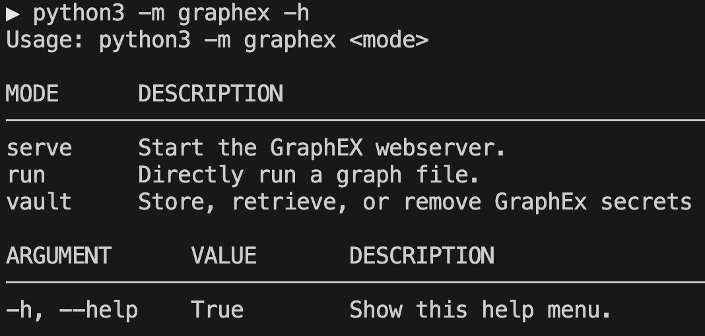

©2025 The MITRE Corporation. ALL RIGHTS RESERVED.
 
The author's affiliation with The MITRE Corporation is provided for identification purposes only, and is not intended to convey or imply MITRE's concurrence with, or support for, the positions, opinions, or viewpoints expressed by the author.'©2025 The MITRE Corporation. ALL RIGHTS RESERVED.
NOTICE
 
This software was produced for the U. S. Government under Basic Contract No. W56KGU-18-D-0004, and is subject to the Rights in Noncommercial Computer Software and Noncommercial Computer Software Documentation Clause 252.227-7014 (FEB 2014)

# About Graphex

Graphex is a visual programming (language) application that allows you to build and execute 'graphs'. Each graph contains 'nodes' that perform different operations in the order created by the user. A fully connected graph is equivalent to a python script (or program).

You do not need any programming knowledge to use Graphex. It was designed to allow anyone to write computer programs (visually) without writing lines of code.


# Installation

GraphEx is available in pip via pypi and is recommended to be installed in a virtual environment (venv):
```
python3 -m pip install mitre-graphex
```

GraphEx has a built in help menu:
```
python3 -m graphex -h
```



You can quickly serve the UI with built-in graph execution via:
```
python3 -m graphex serve
```

Then navigate to https://localhost:8080 to get started creating executable graphs!

# Documentation

For documentation on Graphex usage please read the offical documentation located at: [docs/markdown/index.md](docs/markdown/index.md). <br />

This documentation can also be reached from inside the Graphex UI itself by navigating to 'Help' -> 'Documentation (Tutorial)' on the menu bar. <br />

# Plugins

GraphEx is intended to extended via its built-in plugin system. Plugins enable python3 developers to add custom, encapsulated functionality to GraphEx via nodes and datatypes.

For example, most GraphEx users at the time of this writing experience GraphEx alongside these plugins:
- [GraphEx-ESXi-Utilities](https://github.com/mitre/GraphEx-ESXi-Utilities)
- [GraphEx-Web-Automation-Plugin](https://github.com/mitre/GraphEx-Web-Automation-Plugin)

These plugins add hundreds of nodes for configuring and controlling ESXi and its virtual machines, handling SSH and WinRM connections, running/executing and monitoring ansible playbooks and automating browser interaction via playwright. No coding experience is needed to leverage these automation tools! Simply pip install the plugins alongside the core mitre-graphex package:

```
python3 -m pip install graphex-esxi-utils graphex-webautomation-plugin
```

[Then serve GraphEx](docs/markdown/setup/running.md) and drag the added nodes into your graph to start using them!:

