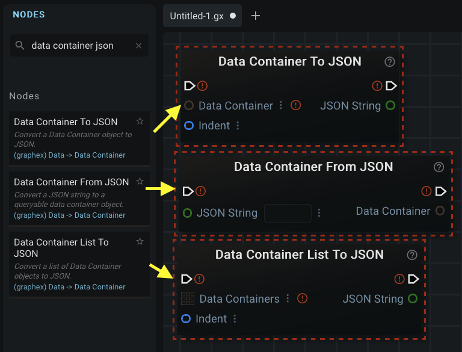
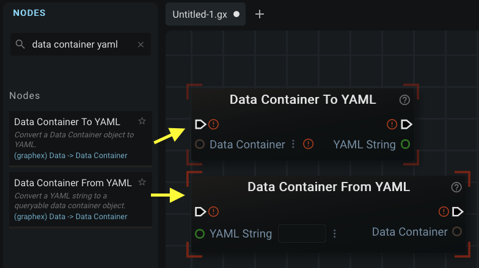
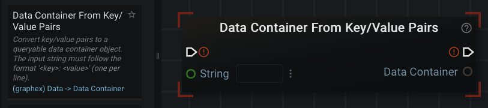
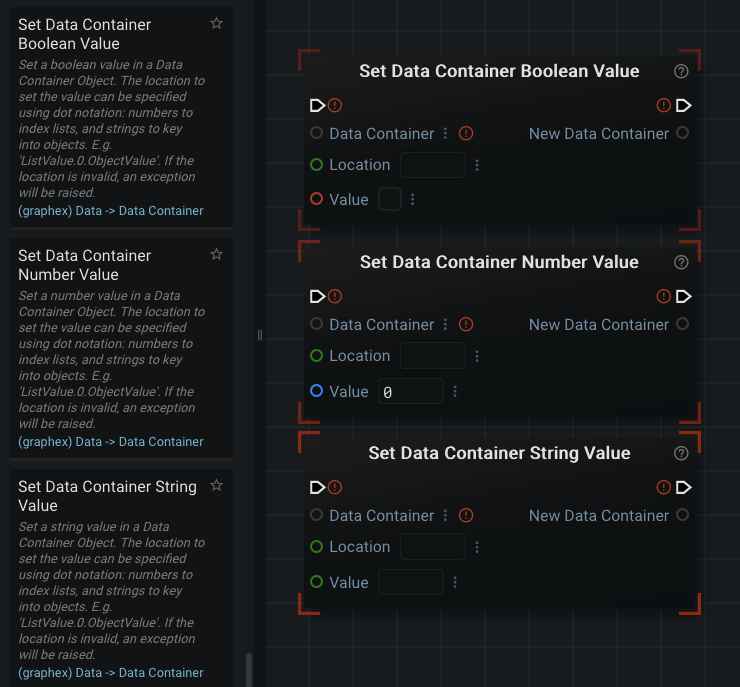
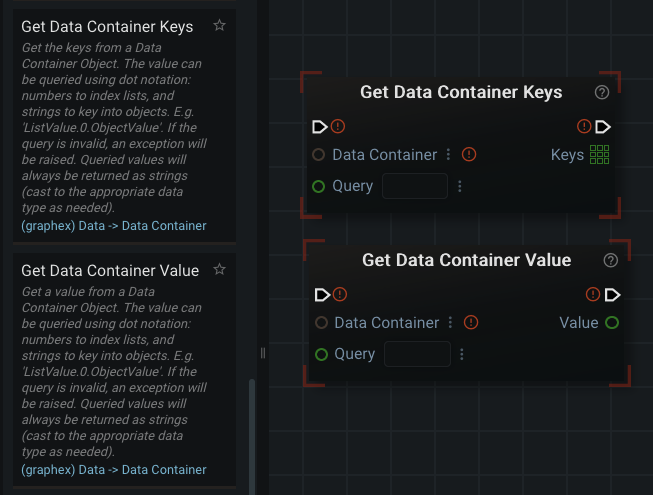
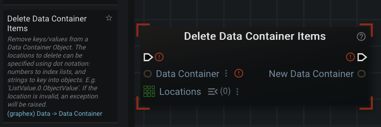

# Data Containers

Data Containers are GraphEx's implementation of Python dictionaries (also known as hash maps in other languages). They are used to store key+value pairs. Their type in GraphEx is simply 'Data Container' and they appear as a brown color in the UI.

Data Container related nodes can be found under the category: "Data" -> "Data Container". It is recommended you read through the node descriptions of each node categorized here, as Data Containers can be quite complicated compared to other nodes.

## JSON

Data Containers can be converted to and from JSON (JavaScript Object Notation) 'Strings' using the nodes: "Data Container To JSON", "Data Container From JSON", and "Data Container List To JSON". Searching the node store for the string: 'data container json' will show all of these nodes in the sidebar:



## YAML / YML

Data Containers can be converted to and from YAML (Yet Another Markup Language) 'Strings' using the nodes: "Data Container To YAML", and "Data Container From YAML". Searching the node store for the string: 'data container yaml' will show all of these nodes in the sidebar:



## Creating a Data Container

The primary way of creating a new data container is by using the node: "Data Container From Key/Value Pairs":



The node expects a string formatted in the form: 'key: value' (without quotation marks). You can provide many key/value pairs in a single string (separated by newlines) if you use a "New String" node as input.

For example, if you wanted to store the key 'address' and the value '123 some street' in a data container you would provide them in a string like this:

```
address: 123 some street
```

## Setting Values in a Data Container

Existing Data containers can have new primitive values added to them or existing keys modified by using the 'Set Data Container ... Value' nodes. Existing options are: 'Set Data Container Boolean Value', 'Set Data Container Number Value', and 'Set Data Container String Value'.



The "location" input socket on these nodes can be the key or, for nested containers, the sequence of keys to get to the data (seperated by dot notation ('.' character)).

Providing a key that doesn't exist will create the key+value pair. Providing a key that does exist will overwrite the existing value in the container.

## Getting Keys and Values from a Data Container

Values can be retrieved from a Data Container by using the 'Get Data Container Value' node. Keys can be retrieved from a Data Container by using the 'Get Data Container Keys' node.

The 'query' input socket allows for 'dot notation' ('.') just like the 'location' input socket on the 'Set Data Container ... Value' nodes.



## Removing/Deleting Values from a Data Container

Data can be removed/deleted from Data Containers by using the "Delete Data Container Items" node. This node expects a list of the locations that can also use 'dot notation' (like the 'Set Data Container ... Value' nodes).




[Return to the Main Page](../index.md)