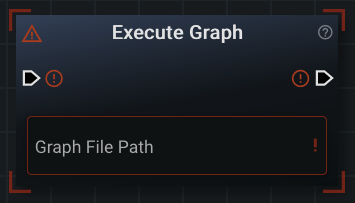
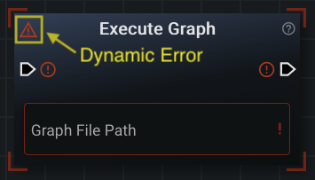
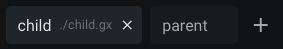
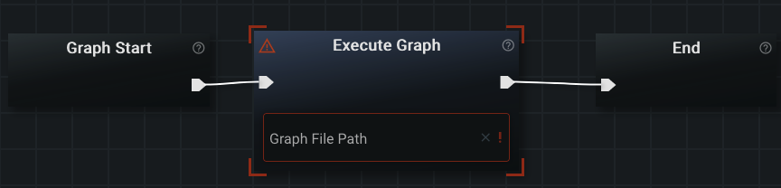
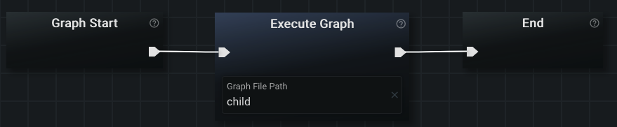
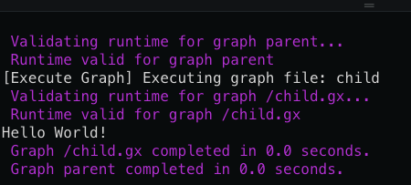
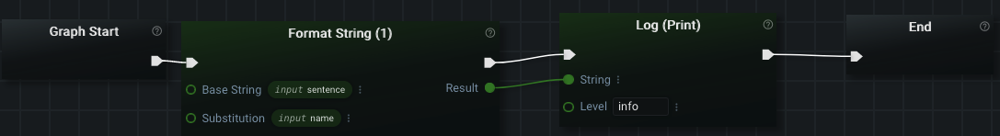
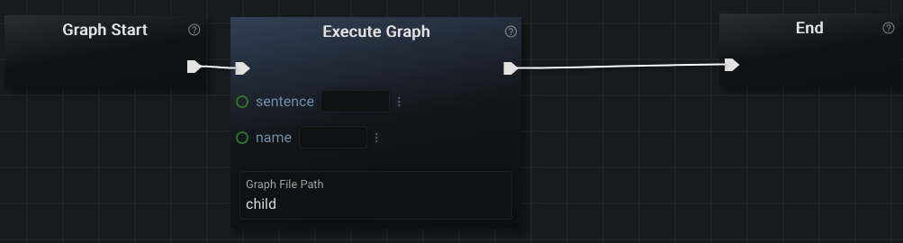
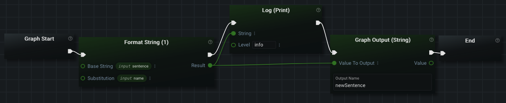
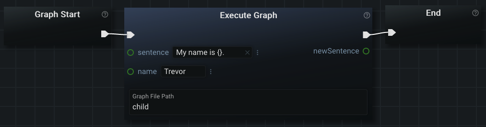

# Execute Graph

The 'Execute Graph' node allows you to execute graphs other than your current one as 'subgraphs' by using them as a singular node. This is similar to creating your own functions in other programming languages.

This node is 'dynamic'. That means the input and output data sockets that it has are generated based on the Graph Inputs and Graph Outputs defined in [the Sidebar Panel](../ui/sidebar.md). If you didn't create any Graph Inputs or Graph Outputs on the graph you are trying to execute through the 'Execute Graph' node, then this node simply won't have any data sockets at all.

This 'blank' (no input/output) node can appears like this in [the Editor Panel](../ui/editor.md):



As described above, there are no data sockets on this particular 'Execute Graph' node. They will be generated when the name of a valid graph is provided to the 'Graph File Path' input field/box.

Dynamic nodes have an additional 'error icon' in the upper left-hand corner to notify you of problems encountered while generating the node:



This error icon can be hovered to get a more accurate description of the problem with this node. These errors will also appear in the 'Errors Panel' on the Sidebar Panel.

Hovering the 'freshly created' Execute Graph node will show us that the problem is: 'No graph file path provided' (meaning we haven't typed in the name of a graph file to execute).

## Running Another Graph

In order to run a different graph, we are going to need another graph (file) to run. As described in [the Editor Panel](../ui/editor.md), we can quickly create another graph by clicking the 'plus' ('+') icon on bar containing the Editor Tabs.

You should now have two default graphs: 'Untitled-1' and 'Untitled-2'. To make things easier to understand, lets rename the two graphs by double clicking on the tabs. Name one of the graphs 'parent' and one of the graphs 'child'.

The graph named 'child' is the one that is going to be executed as a node. For now we will leave it as the default graph that is provided by Graphex. You will need to save the file to the server in order for 'Execute Graph' to be able to find the file to execute. Save the file called child to the server. You should now have two tabs that look like this:



In the graph named 'parent', delete the 'Log (Print)' node. Create a new 'Execute Graph' node and connect the 'Graph Start' and 'End' nodes to it. This should resolve the link socket errors:



The last step is to provide the name of the other graph to run. Type 'child' into the 'Graph File Path' input field/box and then left-click outside of the box to force the node to dynamically update itself.

Your graph should no longer have any more errors:



This is a complete graph that includes an 'Execute Graph' node. You can run the graph called 'parent' and you should see the same output in the terminal as when 'child' is run individually.

Some additional logging output will appear when running the 'parent' graph to inform you of where the output is coming from:



## Providing Graph Inputs

As mentioned in both [the document on the Sidebar Panel](../ui/sidebar.md) and [the document on specialized nodes](nodes.md): you can use 'Graph Inputs' to feed data into child graphs.

Go to the child graph and create two _String_ inputs in the 'Configure Graph I/O' Sidebar Panel:
- One called 'sentence'
- Another one called 'name'

For this example, the 'Input Name' field is the only field you need to change.

Now that we have defined our inputs: we have to use them in the graph! Add a node called 'Format String (1)' from the Nodes Panel to the Editor Panel. This node creates a new _String_ value by replacing a part of one _String_ with another. It accomplishes this by looking for the two characters: '{}' in the 'Base String' value and replaces them with the value provided to the 'Substitution' data socket.

We are going to make all of the inputs to the 'Format String (1)' node 'Graph Inputs'. Using your mouse: left-click the three vertical dots next to the input field for 'Base String'. Choose 'Graph Input' -> 'sentence'. Notice how the options for 'Graph Input' are only the ones you defined in the Sidebar Panel. They also only match the type of data socket (_String_). Do the same thing for the 'Substitution' data socket, but select the 'name' input.

Still in our child graph: lets connect this node in front of the 'Log (Print)' node. The 'flow' of your graph should now be 'Graph Start' -> 'Format String (1)' -> 'Log (Print)' -> 'End'. Finally, lets connect the 'Result' output (data) socket from 'Format String (1)' to the 'String' input (data) socket on the 'Log (Print)' node.

Your graph should now look like this:



If your graph doesn't match the image: modify it now so it does match. Then **save** the graph to the server.

Go back to our graph called 'parent' by left-clicking on the tab for it. You will notice that nothing has changed here. This is because dynamic nodes are only re-generated when absolutely necessary. At the moment, Graphex doesn't realize you changed the file called 'child.gx'. There are three ways to force the dynamic node to update:
- Right-click the node with your mouse to open the context menu and choose 'Refresh' (only available on dynamic nodes)
- Providing the name (path) of a new file to the 'Graph File Path' input field/box
- Save 'parent' graph to a file, close the file, and reopen the file (all dynamic nodes have to re-generate when a file is freshly opened)

Refresh the graph using one the methods mentioned above. You should then see the graph inputs we specified in the refreshed node:



Fill in the newly generated data fields with the following values (without the quote marks):
- 'My name is {}.' for 'sentence'
- '_your name_' for 'name'

Then run the 'parent' graph. In the output, you should see:
```
[INFO ...] My name is ___.
```

You have just created a graph that can be used as a node to combine the 'Format String (1)' node with the 'Print (Log)' node. This example graph that we created can be used over and over throughout the parent graph as a node.

## Providing Graph Outputs

Graph Outputs can be used to get data from the child graph.

Continuing the example we have been following, return to your graph named 'child'. We are going to make the child output the new _String_ value that we logged to the screen earlier.

Create one _String_ output:
- One called 'newSentence'

For this example, the 'Output Name' field is the only field you need to change.

$note$ The capitalization formating of the _String_ 'newSentence' is a format known as 'Camel Case'. This makes it easier for humans to read values that can't contain spaces.

Remember that we will now need to reference the output somewhere in the graph. The easiest way to do this is to right-click the newly created Graph Output in the sidebar and select 'Add Node'. This will create a 'Graph Output (String)' node for you in the graph. It will already have the name of the output filled in for you.

You can either connect this node before or after the print statement. It is simply a matter of preference. The important thing is that the 'Result' socket on the 'Format String (1)' node connects to the 'Value to Output' on the 'Graph Output (String)' node. Remember that output data sockets can be ingested by more than one node at a time. To make this clear, I'm going to connect the 'Graph Output (String)' node in-between the 'Log (Print)' and the 'End' nodes.

The graph will then look something like this:



Now we have to **save** the graph named 'child'. Then return to the parent graph and refresh the 'Execute Graph' node. Your graph should then look like this:



You should be able to run this graph without any errors in the terminal. The output should be the same: we did not modify the logging statement in the child graph. The only difference now is that the graph named 'parent' is able to reuse the value we created in the child.

## Moving On

You can learn more about [multithreading](threading.md) (if you haven't already) or read [the document on configuration files](config.md).


[Or, Return to Main Page](../index.md)