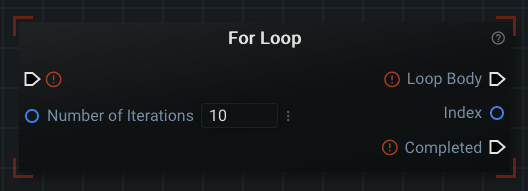
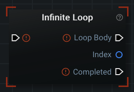
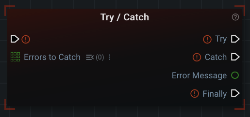

# Specialized Nodes

As covered in the document for [The Editor Panel (Intro to Nodes and Graphs)](../ui/editor.md), there are two primary types of nodes: data and action. While these are the primary two types of nodes, there are some nodes that are either subsets of a primary type or don't fit nicely into one of the two categories at all. This page lists these nodes and gives a brief overview of them.

## Comments


The purpose of the Comment Node is to leave textual notes in your graph. They are unique in that they have no sockets at all. You can place them anywhere in the graph that you like.

You can customize both the color of the node and the text by left-clicking on the 'pallete' icon in the upper right corner of the comment node. This will produce a new window where you can either type in or left-click the color you desire for each:


## Generators

Generator nodes are a subset of data nodes and work the same way. The primary difference is that the data value is 'generated' (created) at the time that the data is needed (instead of being specified by a user).

An example of a generator node is 'Current Unix Timestamp':


This node produces the current time as a Unix Timestamp. It wouldn't do us any good to determine this time at the beginning of the graph. The _Number_ socket produces the time at the exact moment that the action node needs the time.

Constants from traditional programming are also represented as generators in Graphex. One example is the mathematical constant 'π' (Pi):


This node always produces the same value, but there is no need to have a user specify this value each time.

## Loops

Loops are a way of modifying the 'flow' of your graph by repeating a chain of nodes for a set number of 'iterations'. Instead of executing a chain of nodes and then continuing on to the next set of nodes: a loop will repeat the same set of nodes over and over until a 'stop' condition is met.

Consider this example: you want to read data from every file in a directory. Lets say you discover there are 40 files in the directory. You could then call the node to read them 40 times, but that would be painful to graph, hard to maintain and would take a very long time to graph out. Instead, you should use a loop that calls the node that reads 40 times ([see the section on (list) 'For Each' loops farther down this page for a good solution to this specific example](#for-each)).

The two types of loops in Graphex are 'For Loops' and 'Infinite Loops'. 'For Loops' have three different flavors ('For Each' is discussed later underneath [lists](#lists)).

Typically, you finish a 'Loop Body' link chain with a normal ['End' node](#end). Loops do also have [additional specialized ending nodes](#specialized-ending-nodes) that will be discussed after each type of loop is explained.

### For Loop



The 'For Loop' node will execute (sequentially) the nodes that follow the 'Loop Body' link socket 'x' number of times (where 'x' is the data socket 'Number of Iterations'). Each iteration, the 'index' value will update with a number cooresponding to what iteration you are currently on.

All kinds of loops are 'zero-indexed'. That means they start counting from the number 0 instead of 1 (i.e. the index will be 0 during the very first iteration of a loop).

In the image above, the loop will execute the 'Loop Body' ten times and then move onto the node that follows the 'Completed' link socket.

### Ranged For Loop


The 'Ranged For Loop' operates identically to the normal 'For Loop' node (described above). It contains additional inputs to allow you to fine tune the control of the loop. You can specify what the first (starting) index should be, what the last index should be, and by how much to increment the index after each iteration.

### Retry Loop


The 'Retry Loop' node is a combination of a 'For Loop' and a ['Try / Catch' node](#try--catch). It only loops when an error occurs in the nodes following the 'Attempt Body' link socket. The branching sequence of this node is as follows:

1. Execute the nodes in the 'Attempt Body'
2. Execute the nodes in 'After Attempt' (regardless of success or failure)
3. If the 'Maximum Attempts' input socket is set to '2' or higher: Repeat steps (1) and (2) until all attempts have been exhausted
4. If the final retry attempt fails (and the 'Raise Error' input socket is unchecked): execute nodes following the 'On Failure' link socket (Otherwise an error is raised and the program/graph ends immediately)
5. If the 'Attempt Body' was successful or if 'Raise Error' is false: execute the nodes in the 'Completed' branch

The 'Attempt Number' output socket can be used to figure out which attempt you are on (starting from the number 1). The 'Success' (true or false) and 'Error Message' (String) sockets are updated after each 'Attempt Body'.

### List Compression Loop


The 'List Compression Loop' node is a highly dynamic node that allows you to combine and iterate over many lists using a single node. Another way to think of it is as a node that converts many lists into an iterable dictionary (or data container) like object. By default, the node will appear simply with an '+ Add' button on it. You can press this button as many times as you need to create a corresponding number of list inputs on this node. Likewise, a '- Remove' button appears to remove the last added list from the node:


After adding a single list with the button: you will see 'Loop Body', 'Index' and 'Completed' sockets appear just like on a normal 'For Loop'. As you attach list (or individual entries) to the newly created 'List #1' input socket: the input 'List #1' socket will change to the correct color for the connected datatype and a new output socket will appear on the node:


Notice that the newly added 'List #1 Value ...' output socket appears as a singular String in the above image. This value will update to the next one in the list for each iteration of the loop. Some special nodes also give you additional information about the type of input connected to each input loop (e.g. List #1 Value shows  'My List Variable' is connected to 'List #1'). Inventory nodes, 'Get Variable', and 'Get Graph Input' will all automatically use the first connected item to the list to update the name of the output socket for you.

You can connect as many lists as you want to the list compression loop. You can also attach individual (non-list) values to each 'List #...' input. Below are a couple of examples to show you the list compression loop in use:


$note$ Inventory nodes from the same hierarchy connected to list compression loops will show the hierarchy name on the output data socket itself for easier readability by humans.

$warning$ List compression loops rely on index numbers and list length in order to produce a 'flattened' output on each iteration. **ALL** of the provided lists to a list compression loop must be the same length. The loop will stop iteration when it reaches the end of the shortest attached list. One trick to artificially extend the length of your lists (to make them match in size) is to add things like 'empty strings' (using the 'New String' node) to the end of the shorter list. Then during the loop you can check for empty strings and handle them appropriately in whatever way suits you.

$note$ Since this node is highly dynamic you will notice the output sockets will sometimes appear in different sequences than the 'Completed' link socket. Once the graph has been saved and reloaded: they will appear in the usual order ('Loop Body', 'Index', ...values..., 'Completed')

### Infinite Loop



The 'Infinite Loop' is a **dangerous** loop that executes the nodes in the 'Loop Body' link socket forever. Your program **will not exit** unless you plan ahead. This loop is meant to manually exited via [the 'Loop Break' node](#loop-break) (described in the next section). You should use this loop if there is some condition that you want to evaluate before exiting the loop.

The index value starts at zero just like a normal 'For Loop' node.

This loop is the closest thing Graphex has to a traditional 'while' loop in other programming languages.

### Specialized Ending Nodes

There are two nodes that can only be used from inside a loop: 'Loop Break' and 'Loop Continue'.

#### Loop Break


The 'Loop Break' node allows you to exit a loop early. It should also be used to exit an 'Infinite Loop'. When this node is reached in any 'Loop Body', the graph will _immediately_ continue down the 'Completed' link socket of the loop (skipping any other iterations that may have happened).

#### Loop Continue


The 'Loop Continue' node is a specialized form of [the 'End' node](#end) that only applies to loops. Its purpose is to 'skip' any link sockets that may have executed after an 'End' node was reached inside a loop and instead start the next iteration of the loop.

This node can be difficult to understand without an example. Consider the following graph:


For the sake of the example, pretend the _Boolean_ data node is some condition that can change between each iteration of the loop (not included for simplicity). Regardless of what the _Boolean_ value is, the graph will always output one of these sequences to the terminal (ten times):
- '[INFO - ...] Its False...' followed by '[INFO - ...] Both Execute me!'
- '[INFO - ...] Its True!' followed by '[INFO - ...] Both Execute me!'

Consider for a moment if you wanted to print 'Its True!' to the screen but didn't want to execute 'Both Execute me!'.  How would you do it? If your branching structure is more complicated, it might eventually become difficult to change the type of conditional node ('If / Else / Finally') or the nodes in the other branches. This is where you would use a 'Loop Continue' node. The 'Loop Continue' node would ignore/skip any parts of execution that would normally happen after a branch (e.g. the nodes following the 'Finally' link socket above).

To make sure the point is clear, one way to print '[INFO - ...] Its True!' ten times (by itself) would be to change out the 'End' node in the top ('If True') link socket with a 'Loop Continue' node:


## Lists

Lists themselves aren't specialized nodes but are a type of data that have specialized nodes. In Graphex, lists are a data _structure_ that contain many values of a single type. For example, you could have a list of strings, or a list of booleans, but not a list of both strings and booleans.

You can think of lists as a container of values. The values are ordered in the order you insert them to the list (the first value is first, second is second, etc.). Since they contain many values, you need specialized action nodes to manage them.

The specialized nodes for lists are autogenerated. Graphex will automatically create every special node listed below for each 'normal' data type that exists. This includes plugins! When plugin authors create new data types: Graphex automatically creates the nodes to support a list of that new data type. All special, autogenerated list nodes will tell you the data type they were generated for in the parenthesis to the right of the name of the node (e.g. see [create empty list](#create-empty-list) below).

$note$ The images you see for the List nodes below are slightly different than what you will see in GraphEx now. The nodes specific to lists no longer show their datatype in parenthesis next to the name of the node. Many of them will also appear in a grey color until you connect data to them. In this way they are 'dynamic' and infer the correct datatype to use when you connect the data for the first time.

### List Data Sockets

List data sockets visually appear as a 3x3 grid of squares instead of a (singular) circular socket:


The color of the data type for a list socket is the same as that of the 'normal', singular data type.

As long as the data type matches: you can connect both 'normal' and list data to a list socket. This must be one of:
- A single List data type
- One or more singular 'normal' data types

List sockets have right-click context menu options to add both 'blank' singular and [empty list data](#create-empty-list) connections to them.

You can also create a list of 'literal' values. Literals were first described under ['What is a Variable?' on the Sidebar Panel document](../ui/sidebar.md). A left-clickable 'list with caret' icon will appear next to list data sockets that you can manually add values to:


Left-clicking on the '+ Add' button will allow you to start typing in the literal value you desire. In the image below, I wrote 'My String Input' in as a literal value. To the right of the text box there is a 'handle' icon that you can use to reorder multiple literal inputs. You reorder inputs by holding down the left-click button on your mouse and 'dragging' the literal to the position you want in the list. To the right of that (all the way right) is a 'Garbage Can with X on it' icon that you can use to delete any literals you added to the list. The sequence of values in the list will match the literal inputs from top to bottom.


Manually creating a literal list on a list input socket is one way of creating a list. More ways are described in the following nodes.

### Create Empty List


The 'Empty List (...)' node is [a generator node](#generators) that produces a list with no values for a particular data type. It is one way of creating a list. This node is particularly useful if you need to provide a list as an input to a data socket, but you don't want to provide any individual values to the list.

### Append To List


The 'Append To List (...)' node is an action node that adds a singular value to the **end** of a list of values. The list value does not have to be provided (making this another way to create a list (of one value)).

### Extend List


The 'Extend List (...)' node is an action node that [appends (see above)](#append-to-list) each value in the 'Items to Append' list to the 'List of Values' list.

### Insert In List


The 'Insert In List (...)' node is an action node that operates [similar to the 'Extend List (...)' (see above)](#extend-list), but it specifies a specific place (index) in the list in which to insert those values.

In the image above, you can see that (by default) the values will all be inserted to index 0 (the **beginning** of the list). In contrast, appending always inserts to the **end** of a list.

### Reverse List


The 'Reverse List (...)' node reverses all the values in the list. This means the first value in the list becomes the last and the last value in the list becomes the first (etc.).

### List Contains


The 'List Contains (...)' node searches the 'List of Values' input for a specific value in the list. If the search query is found, then the 'Contained in List?' _Boolean_ output will be 'True'. If the value is not found, the output will be 'False'.

You will also be able to retrieve the index of the value found in the list (if found). If not found, the 'Index' value will be '-1'.

You are always going to want to use this node before attempting to retrieve a value from a list. Attempting to use a node like ['Get List Item (...)'](#get-list-item) on an index that doesn't exist will result in a critical runtime error.

### List Index Of


The 'List Index Of (...)' node searches the 'List of Values' input for the index of a specific value in the list. If duplicate matches exist in the list: the first index of the first match is returned. It is is similar to the 'List Contains (...)' node above.

There is an input data socket called 'Starting Index' that you use to choose where the search starts in the list.

### List Contains Any


The 'List Contains Any (...)' node is identical to the 'List Contains (...)' node except that it accepts a list of values to search for instead of a singular value. The output will be 'True' if any value in the list of 'Values to Search for' appears in 'List to Search'.

### List Contains All


The 'List Contains All (...)' node is identical to the 'List Contains (...)' node except that it accepts a list of values to search for instead of a singular value. The output will be 'True' if **ALL** values in the list of 'Values to Search for' appears in 'List to Search'.

### Get List Item


The 'Get List Item (...)' node retrieves a value from the list at the provided index (place) in the list. A 'list index out of range' critical error will occur if a value doesn't exist at that position in the list (e.g. the requested index is greater than or equal to the number of items in the list). Use [the List Size (...) node](#list-size) or [the 'List Contains (...)' node](#list-contains) to check the list before retrieval.

### List Pop


The 'List Pop (...)' node both retrieves and removes an item from the list (at the specified index). The default index to remove from is the last item in the list ('-1').

### Slice List


The 'Slice List (...)' node returns a subset of the orignal list. You provide two bounding indices and the node outputs all the values that fall within that range (in a new list).

### List Size


The 'List Size (...)' node outputs the length/size of the list (how many values it contains).

$warning$ The size of list starts counting from the number 1. Indices start counting from index 0 (called 'zero-indexed').

### For Each


The 'For Each (...)' node is [a type of loop node](#loops). If the list has at least one value: it iterates over each value in the list. Each index and data value are provided as outputs for use in the 'Loop Body' link socket. Lists that have no values immediately proceed to the 'Completed' link socket.

## Sequence


Sequence nodes are used to organize the 'flow' of your graph into distinct chains. They contain two or more output link sockets. When an executing graph reaches a sequence: it will execute the event chains in order (e.g. 'First Event', then 'Second Event', etc.). You mark the end of a single chain of execution with [an 'End' node](#end).

I modified the default graph to provide a quick example:


The output will look like:
```
[INFO - ...] Hello ...
[INFO - ...] World!
[INFO - ...] I output last.
```

## Conditional Statements

Conditional Statements 'branch' your graph based on _Boolean_ values. These branches are similar to sequences, but both 'paths' aren't followed. Only the path that evaluates to 'True' is the followed branch. The other branch is ignored entirely and will not be executed at all.

There are many different flavors of conditional statements available to you in Graphex. You can accomplish what you want to check in many different ways. It is recommended you use the minimum amount of nodes possible when checking _Boolean_ values via conditional logic.

### If / Else

The most common type of conditional statement is the 'If / Else':


When you first add one of these nodes to the graph: it will come with a simple checkbox to determine which path to follow. It is unchecked by default, which is equivalent to 'False'. This means only the bottom link output socket will be followed in the graph.

The checkbox on its own isn't real useful. What you should pay more attention to is the fact that it is a _Boolean_ data socket (and thus can accept input from other sources).

In Graphex you will find that many action nodes output a _Boolean_ value based on some truthy statement. These _Boolean_ values are typically determined at _runtime_.

One such example might be checking if a string contains a path to a directory that exists on disk. If the directory exists (if 'True'), we can write information to a file in that directory. If it doesn't exist (if 'False'), then we need to create the directory before we can write information to it:


Only one branch of 'If True' or 'If False' will be executed when the program runs. It isn't possible for us to know if that directory exists on every computer that will ever run our graph. Combining the 'Path is Directory' node with the 'If / Else' node allows us to avoid the error that occurs if you try to write to a file in a directory that doesn't exists.

$note$ In the above example, you would likely want to add another 'Write String to File' after 'Create Directory...' in order to achieve the desired effect (as described in the example). A better way to do it would be to use the node described in the next section 'If / Else / Finally' (or a 'Sequence' node) to avoid duplication. If you are noticing that you are duplicating more complex sequences of nodes, it would be better to have two ['Execute Graph' nodes](#execute-graph) instead.

### If / Else / Finally


You may have noticed that the 'If / Else' node doesn't have a 'common' branch between 'If True' and 'If False'. You only get one or the other. In the example in the previous section: we want to write to a file regardless what branch we end up following. One way of accomplishing this is with a 'Sequence' node that evaluates the 'If / Else' node as the first event, and then the writing to the file in the second event.

Another way is to accomplish this task would be using the 'If / Else / Finally' node to create the directory 'If False' and write to the file after 'Finally'. In this particular case you would want to add an 'End' node after 'If True' (you can simplify this particular example further by using a singular 'If False / Finally' node [see the next section]).

The 'If / Else / Finally' node essentially combines the 'If / Else' and the 'Sequence (2)' nodes. Regardless of the conditional branch chosen, the 'Finally' link socket will always execute afterward.

### Singular Conditionals

The opposite mentality of 'If / Else / Finally' is simply 'If True' or 'If False'. These nodes only continue the graph if the condition is met. If the condition is not met, then the node will act just like an 'End' node.


If you want to test only one value and then continue the graph: use 'If True / Finally' or 'If False / Finally'.


## Conditional Operators

In the previous section, we covered 'Conditional Statements' that consider a _Boolean_ value and follow a particular branch based on that singular _Boolean_ value. What if you want to follow a branch based on multiple _Booleans_? You would need to use a conditional operator. These operators combine _Boolean_ values in different ways to output a new _Boolean_ value that captures the 'truthfulness' of the combination of values.

It is worth noting that all of these are simply action nodes that take in one or more _Boolean_ values and output a single _Boolean_ value. There are similar action nodes for _String_ and _Number_ data types that will not be covered here (they output a single _Boolean_ based on some action).

### And


The 'And' node takes in a list of _Boolean_ values and outputs a _Boolean_ with the value 'True' only if all input values are 'True'. It outputs 'False' if any of the inputs are 'False'.

### Or


The 'Or' node takes in a list of _Boolean_ values and outputs a _Boolean_ with the value 'True' if any of the input values are 'True'. It outputs 'False' if all of the inputs are 'False'.

### Equal


The 'Equal' node outputs 'True' if both input values are the same (both 'True' **or** both 'False'). It outputs 'False' if the input values are different (i.e. one is 'True' and one is 'False').

### Not Equal


The 'Not Equal' node is the opposite of the 'Equal' node. It outputs 'True' if the input values are different (i.e. one is 'True' and one is 'False'). It outputs 'False' if both input values are the same (both 'True' **or** both 'False').

### Negate / Not


The 'Negate / Not' node will flip the 'truthfulness' of a single input _Boolean_ to the opposite value. It outputs 'True' if provided with 'False'. It outputs 'False' if provided with 'True'.

Negate/Not operators are also commonly referred to as 'flipping the bit'. This is because a 'True' value is stored as the value '1' whereas a 'False' value is stored as a value '0'. A bit can only be a 0 or a 1.

## Try / Catch



The 'Try / Catch' node attempts to execute the sequence of nodes you provide after the 'Try' link socket. If any of the nodes encounters an error/exception, then the nodes after the 'Catch' link socket are executed. Afterward, the node continues down the 'Finally' link socket.

You can provide values to the 'Errors to Catch' data socket to only 'Catch' specific errors. If this list is empty the node will assume you want to catch any error that occurs.

## Raise Exception


The 'Raise Exception' node allows you to immediately create/raise a custom error. You can provide a custom name and a custom message for the error/exception. This node executes immediately when reached by the program and causes the program to end in a 'critical' error state.

## Variables

Variables were first discussed [in the Sidebar Panel document](../ui/sidebar.md). Once a variable is 'set' (created), it will exist at all following points in the graph (but doesn't exist before it is set for the first time). Variables are available as inputs both as nodes you can connect to input sockets and as dropdown options inside nodes themselves.

Just like some of the 'List' nodes, the specialized nodes for variables are dynamically generated. Graphex will automatically infer the type of the data that you are connecting to the Variable node. Simply connect the data you want to save to the 'Set Variable' node to have it save it for you in the proper datatype.

Variable nodes can be created either from the 'Nodes Panel' or from the 'Variables Panel'. Creating variable nodes from the 'Variables' Panel is discussed [in the Sidebar Panel document](../ui/sidebar.md). The next couple sections describe variable nodes created from the 'Nodes Panel'.

### Set Variable


The 'Set Variable' node assigns a variable to a name that you give it. When you first create the node from the Nodes Panel: the 'Variable Name' input field/box will be empty. It will be outlined in red to show that there is an error with the node. Fill in the name field with a name of your choosing. If the name doesn't exist: this node will create the variable. If the name does exists: this node will **overwrite** the previous value stored to this variable.

Provide the data that you want to save to the 'Value to Save' data socket. Since this node needs to infer the type of the data connected to it: the only way to connect data to this socket is by a connection itself (e.g. attaching a colored edge in the editor panel to the input socket).

For example, I can attach a 'String' data node to the 'Value to Save' data socket and the color of the node will change to the green 'String' color:


 The 'Value' output data socket simply mirrors the input you provide to 'Value to Save'. It won't appear on the node until the datatype is inferred by the node itself.

### Append to List Variable


The 'Append to List Variable' node operates identically to [the 'Append to List' node](#append-to-list), except that this particular node applies to variables.

You can think of it as a special 'Set Variable' node for list data. Likewise, it will create a list variable if the 'Variable Name' you provided does not exist. If it does exist, the value is added to the end of the list.

### Variable Exists


The 'Variable Exists' node checks for the existance of a node. It should be used if the creation of variable happened dynamically (on a separate branch) and you want to ensure that a value exists before attempting to use it. Trying to retrieve a variable that doesn't exist will result in a runtime error (ending your program).

### Variable Exists (If / Else)


The 'Variable Exists (If / Else)' node is a combination of the 'Variable Exists' node and an 'If / Else' node. It is provided for convenience.

### Get Variable


The 'Get Variable' node retrieves a variable previously set by either 'Set Variable' or 'Append to List Variable' (for lists). Trying to retrieve a variable that doesn't exist will result in a runtime error (ending your program).

Typing in the name of a variable that you previously set in this graph will change the color of the node to the datatype of the set variable. It will also reveal the output socket that you can use to input this data into other nodes:


$note$ Remember that fields that dynamic search for things (like the one here) need you to left-click outside of the node in order to update themselves. You can also right-click the node and select the 'Refresh' option to force them to update.

## Graph Inputs and Outputs

Graph Inputs and Outputs were first discussed [in the Sidebar Panel document](../ui/sidebar.md). Graph Inputs are available on sockets both as nodes and as dropdown options.

Just like 'List' nodes, the specialized nodes for Graph Input and Outputs are autogenerated. Graphex will automatically create every special node listed below for each data type that exists. All special, autogenerated list nodes will tell you the data type they were generated for in the parenthesis to the right of the name of the node.

### Get Graph Input Node


The 'Get Graph Input' node retrieves a 'Graph Input' that was previously set via [the Sidebar Panel](../ui/sidebar.md). Trying to retrieve a 'Graph Input' that doesn't exist will result in a runtime error (ending your program). These nodes are like the 'Get Variable' nodes in that they will update to give you an output socket only after you give them the name of a properly defined Graph Input.

### Set Graph Output Node


The 'Set Graph Output' node operates similarly to [the 'Set Variable' node](#set-variable) except that it applies to 'Graph Outputs'.

As mentioned in [the Sidebar Panel](../ui/sidebar.md) document: 'Graph Outputs' have no effect on the 'top level' graph that can be executed via the Command Line Interface (CLI, e.g. the 'main' level graphs). Instead, they appear as 'dynamic' data output sockets on an ['Execute Graph' node](#execute-graph) (described below). Their only purpose is to be treated as outputs from 'Execute Graph' nodes.

## Execute Graph

The 'Execute Graph' node allows you to execute graphs other than your current one as 'subgraphs' by using them as a singular node. This is described in more detail [on the dedicated page for the 'Execute Graph' node](executeGraph.md).

## Graph Start


The graph start node indicates where execution should start when the graph is run. That is its only purpose. There should be only one graph start node in a graph.

## End


The end node indicates the end of a sequence of nodes. This could mean the end of a graph, sequence, the end of a loop, etc. There is no other purpose for an 'End' node.

End nodes can be quickly added and connected to your final output link socket in a chain by right-clicking on the link-socket and selecting "Add Node: 'End'".

## Cast


As introduced in [The Editor Panel (Intro to Nodes and Graphs)](../ui/editor.md), cast nodes convert one data type to another. They are color coded to show you which types are being converted. The individual data sockets themselves can also be hovered to find out the name of the data type being converted.

In the image above, the following cast nodes are shown:
- Number to String
- String to Number
- Boolean to String
- String to Boolean

$warning$ Graphex will not stop you from trying to convert things that don't make sense. You may not get an error while creating the graph, but you will get an error when running the graph (e.g. trying to convert a string with words into a number).

You don't have to search for which cast nodes are available. If the conversion you are trying to do makes sense, then the developer has probably implemented a cast node for you. Start by trying to connect together the data types you think should be compatible:


Graphex will automatically find the correct cast node for you and connect everything together:


Now the number '123' will be outputted to the screen when the program runs.

Remember that not every data type will be able to convert into another. You may have to use an action node to convert your types instead. For debugging purposes, it is fairly normal for any data type to be converted into a _String_ for printing/logging to the screen.

## Defer


The Defer node acts as a cleanup mechanism for your program. Similar to sequences: it has two output link sockets. Any chain linked to the first (upper) 'Deferred Nodes' link output socket will be run at the end of the program (regardless if an error occured or not). The nodes after 'Deferred Nodes' will **not** be run immediately. They are simply stored for execution later and then the graph continues through the 'Continue' link output socket.

This node is primarily useful for resource cleanup. One example might be a connection to an external resource such as a database. You can add the logic to disconnect from the database to 'Deferred Nodes'. After it is added, you don't have to worry about closing the connection anymore (even if an error occurs).

## Debug Breakpoint


The Debug Breakpoint (Log) node is solely intended for humans to help find mistakes in their graphs at runtime. Its primary function is to completely exit the program when the 'End Program' Boolean input socket is enabled. In addition to this, you have the option to log to the terminal all of the following: the Graph Inputs provided to this (sub)graph, the variables assigned to this (sub)graph, and any 'String' value of your choice. All of these will be output to the terminal before the program exits. You can also adjust the logging level (just like a normal logging statement).

$warning$ The way that the program exits when using this node IS NOT SAFE for use in general. It will not cleanup and exit the application in a proper way (this is especially true for threads). Only use this node to troubleshoot problems with your graph and then promptly remove it from your graph.

## Multithreading

Running multiple threads inside Graphex is perhaps the most advanced/complicated use of the application. Information about it and the nodes involved in it can be found on [its own document describing multithreading](threading.md).

## Moving On

If you don't plan on using (or don't want to) learn about [multithreading](threading.md), it is recommended to read [the document on configuration files](config.md).


[Or, Return to Main Page](../index.md)