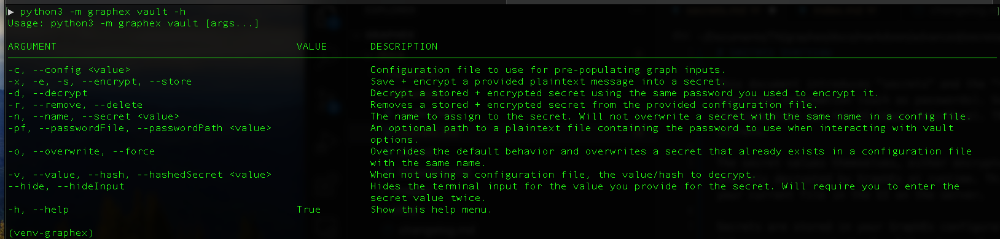
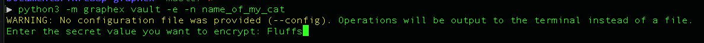
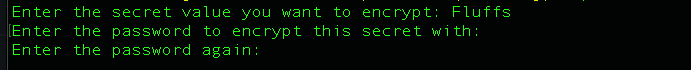
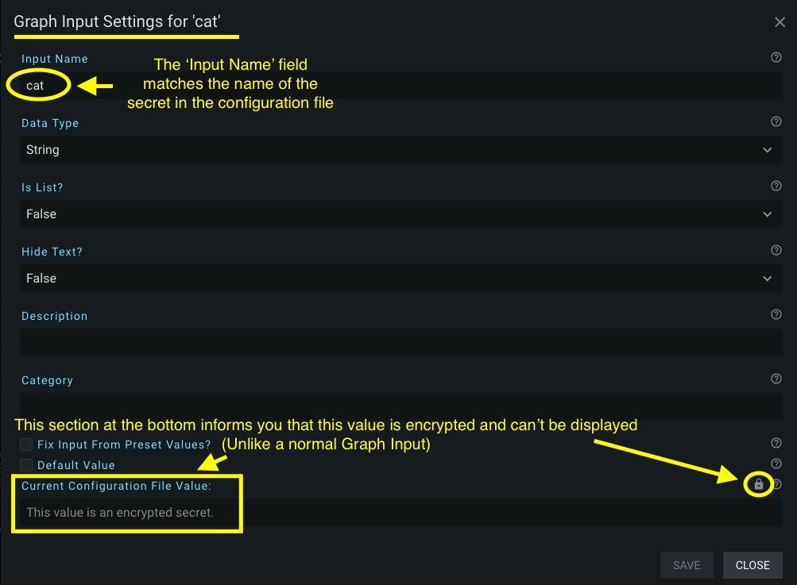

# Secrets Overview

This document introduces "secrets" and the "vault" CLI (Command Line Interface) mode. Secrets are encrypted values that contain sensitive information (such as passwords). Secret values are unique in that they can't be viewed in plaintext from either the configuration nor the UI (User Interface). The "vault" mode on the CLI is used to manage all of your encrypting needs for secrets.

The secret values themselves, either encrypted or decrypted plaintext, will never leave the GraphEx server when served. Secrets are only decrypted by GraphEx at runtime. This means when you either run a file on the command line or ask the client to run your current file in the UI on the server.

Secrets are stored in your GraphEx configuration file. You can either manually copy encrypted secrets in to your configuration file or you can ask the "vault" mode to place them in your configuration file for you automatically.

$note$ Secrets are NOT the same as the 'Hide Text?' field when creating a Graph Input in the UI sidebar. The 'Hide Text?' option in the sidebar simply gives you the option to toggle the visibility of the field in the UI. In contrast, encrypted secrets are NEVER viewable through the UI and are not provided to the client in any way.

$note$ It is your responsibility to use unencrypted values responsibly in your graph. The program isn't going to prevent your manupulation of these unencrypted values at runtime.

## Vault Mode

The 'vault' mode on the GraphEx CLI is the only way to create secrets that can be used by the GraphEx program. The 'vault' mode lets you take the following actions from the command line: encryption, decryption, storage of secrets in configuration files, and removal of secrets from configuration files.

Similar to 'run' and 'serve', you can invoke the 'vault' mode help menu from the command line like so:
```bash
python3 -m graphex vault -h
```

The terminal will then output the list of available arguments for the 'vault' mode:



If you want the 'vault' mode to store encrypted values in your configuration file automatically, then you will have to provide the path to the configuration file you want to store them in. You can do this by providing either of the arguments (*-c* or *--config*) followed by the path to the file. Alternatively, if no argument is provided, GraphEx will attempt to find the 'default' configuration file in your current directory (currently called *graphex-config.yml*). If the 'default' configuration file is found it will be used automatically for storing your encrypted secrets.

If a configuration file can't be found by either of the methods mentioned above you will not be able to use the *--remove* argument and both the *--encrypt* and *--decrypt* arguments will assume you don't want to use a configuration file. This means *--encrypt* will output your encrypted value to the terminal and *--decrypt* will expect you to provide an encrypted value with the *--hashedSecret* argument.

The following sections will give some examples of how to provide various combinations of arguments to perform the various actions of: encrypt, decrypt, and removal.

### Encrypting a Secret

Use the *-e* (or *--encrypt*) flag to encrypt a secret value. An encrypted secret is stored as a 'key: value' pair in GraphEx. You use the 'key' to reference the value for encryption and decryption. In GraphEx, the 'key' is known as the 'secret name' or 'name of the secret'. This argument is provided via *-n* (or *--name*). The name of the secret will be visible via the configuration file and the UI but not the value.

Encrypting a secret and having the output displayed in the terminal (note that *-n* is optional when not using a configuration file):
```bash
python3 -m graphex vault -e -n name_of_my_cat
```

By default, the value of the secret is shown in plaintext during entry in the terminal:



The secret value is shown in plaintext in the terminal simply for convience. If you need to hide the input field for your secret value, you can override this behavior with the *--hideSecret* flag. This will enable the secret value input field to be a password input instead of a plaintext input. Since you can't see the value you are typing, this option will force you to enter the secret value twice to confirm.

Once you've entered the secret value you want to store, the vault will prompt you to create a password to encrypt this value with. You need to enter this password twice:



The terminal will continue to ask you for password (and/or secret value input) over and over until you successfully enter the same input twice. Then it will display the text: '*The encrypted secret is:*' followed by the encrypted hash on the next line of the terminal. This hash can then be copied into your graphex configuration file like so:
```yaml
secrets:
    name_of_my_cat: the_secret_hash
```

Alternatively, you can provide the *-c* (*--config*) argument to save the output directly to your configuration file:
```bash
python3 -m graphex vault -e -n name_of_my_cat -c /path/to/config/file
```

Once you have completed the encryption of a secret, the 'vault' will ask you if you want to continue entering secrets with the same vault password. Respond with 'y' for 'yes' or 'n' for 'no'. The program will continue to loop like this until you tell it to exit with the 'n' option. While entering additional secrets the program will not exit if you attempt to overwrite an existing value in the configuration file. Instead, it will prompt you if you want to overwrite it or not. If you choose not to overwrite the program will return you to the "Would you like to encrypt another..." prompt.

#### Handling Encryption with Existing Values in Configuration Files

If you try to encrypt a "secret name" that already exists in a configuration file: the program will throw an error and exit. It does not want you to overwrite a value that already exists in the file. To override this default behavior (and overwrite an existing secret value with a new one) you can provide the *-o* (or *--overwrite*) flag.

Of course, you could also choose to *--remove* the existing key and then add a new one with the same name (as described below in the removal section).

### Decrypting a Secret

Use the *-d* (or *--decrypt*) flag to unencrypt a value that was previously encrypted using this tool. You can either retrieve a value to decrypt by the secret name (key name) in the configuration file OR you can provide the *-v* (*--hashedSecret*) argument in front of the hash to decrypt.

For example, to decrypt a hash solely from the terminal:
```bash
python3 -m graphex vault -d -v the_secret_hash
```

Likewise, to decrypt a value from a configuration file by name:
```bash
python3 -m graphex vault -d -n name_of_my_cat -c /path/to/configuration/file
```

Regardless if a configuration file was provided or not: the decrypted, plaintext value will appear in the terminal output.

### Removing a Secret from a Configuration File

There are two ways to remove a secret (key/value) pair from a configuration file:
1. Simply open the file and delete the line corresponding to the secret name you wish to get rid off (also remove the "secrets:" line if it was the last secret in the file)
2. Use the vault mode with *-r* (*--remove*) flag

The following is an example of removing the secret with name "name_of_my_cat" from a configuration file:
```bash
python3 -m graphex vault -r -n name_of_my_cat
```

## Password File

GraphEx provides two different ways to provide a vault password for encryption and decryption of secrets:
1. The program will prompt you for a password on the command line when encryption/decryption is required
2. You can provide the path to a file containing the vault password on the first line of the file

Option **(1)** is enabled by default in GraphEx. It will prompt you for the vault password when it needs it for encryption related operations (including in the 'run' and 'serve' modes of GraphEx). Option **(2)** can be provided with the *-pf* (or *--passwordPath*) argument.

When providing a valid file containing the vault password in plaintext (via the argument *-pf /path/to/file*): GraphEx will use this password for encryption related operations without prompting you for terminal input.

The idea behind this file is that you could restrict read access to the file at the level of your user (e.g. using *chmod* and *chown* in Unix systems). By restricting other users from being able to read the password file, you then have a convient way to provide a password to vault. Please keep in mind, however, that the GraphEX python interpreter must have the same access to this file as the user that has restricted access to it.

To make this argument even more convient to use, you can provide the path in your configuration file like so:
```yaml
# in the yml configuration file
vault_password_path: "/path/to/my/read/access/restricted/file"
```

## Running and Serving GraphEx when the Configuration File has Secrets

When you use the **'serve'** mode of GraphEx and your configuration file has any 'secrets' stored in it (at all): GraphEx will prompt you for the password to decrypt your secrets. Your options for providing this password are the same as [described in the previous section.](#password-file)

When you use the **'run'** mode of GraphEx: you will only be asked for a vault password if the graph you are trying to run contains a secret value that needs to be decrypted.

### Using Your Secrets in the User Interface (UI)

This section assumes the following has happened regarding secrets:
1. You've used the command line 'vault' mode to encrypt a secret
2. The encrypted value is stored in a configuration file under a section called 'secrets' with a secret name and encrypted value
3. You have a GraphEx server running from the 'serve' mode and it has the configuration file with your secrets in it
4. You've decrypted the values provided to the running server via either the terminal input prompt or by using the *--passwordPath* argument (*-pf*)

Secret detection in the UI is similar to the detection of the values of other 'Graph Inputs' stored in your configuration file. You use 'Graph Inputs' as normal and give them the name of your secret that you want to retrieve. For example, I can create a Graph Input in the sidebar and provide the name of the secret from my configuration file ('cat' in this case):



You can then use this value in your graph anywhere a normal Graph Input can be used.

Should you decide to run the graph from the UI, again the UI will inform you that you can't see the value because its encrypted:


The value for the secret Graph Input 'cat' in the image above will only be available in plaintext when the server executes your graph. No transfer of the encrypted value happens between the client and the server. When you click 'run' GraphEx will automatically decrypt the value for the secret named 'cat' and use that plaintext value in your graph anywhere 'cat' is used as a Graph Input.

### Subgraphs

Secrets are not applied to subgraphs. If your graph requires a secret at ANY level (including sub/child levels): create a Graph Input at the top (parent) level and pass the value down into the subgraphs that need it.

## Known Issues

The issues listed here are known but may not be fixed for a variety of reasons.

- When using the 'vault' mode to store/retrieve encrypted values: the resulting configuration file is stripped of comments and reformatted
    - If this is a deal breaker for you: consider encrypting/decrypting without using the configuration file argument (*-c*) and manually copy/pasting/removing the lines from the configuration file


[Return to Main Page](../index.md)