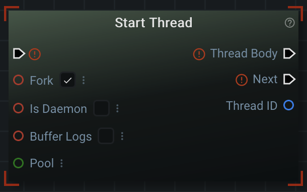
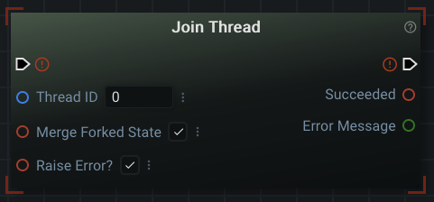
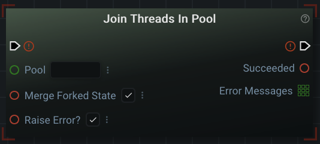
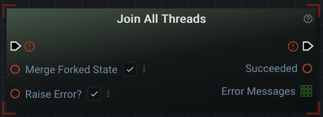

# Multithreading

In every other document up until this one: Graphex has been running your graphs in a single _thread_. A good metaphor for threads is human workers or laborers. Its the size of your 'team' available to get work done. Some tasks can be accomplished quicker if you have more workers. Likewise, if there is really only 'one thing' that needs to be done, there may not be any benefit to having more workers.

Each time you run a Graphex graph, Graphex runs/executes the graph in its own _process_. You can think of these as standalone programs or applications. Running many graphs at once is like having several applications open on your computer at the same time. In metaphorical terms, you might think of a process as its own project. Each project would then have a different team (_thread pool_) assigned to it.

To summarize, Graphex provides each _process_ a single _thread_ by default (each project has a single worker). This _thread_ is sequentially executing the nodes in your graph. If you find that there is a task that could be done faster by _parallelizing_ it, you can use one of the special threading nodes described in this document.

Threading can be quite complex to use and manage. You need to consider ahead of time what 'resources' the thread is going to need to have access to. Disaster can occur if multiple threads are modifying and reading the same data at the same time. Additionally, you have to manually create and destroy threads. It is possible to end up in situations where a 'deadlock' occurs (and the program can't exit). This is discussed more in [the section on joining threads](#joining-threads).

## Start Thread

The 'Start Thread' node is visually similar to [loops](../advanced/nodes.md). You have a link output socket for the 'Thread Body' and the 'Next' link socket. When the graph executes a 'Start Thread' node, the nodes connected after 'Thread Body' will become the nodes that the new thread will execute. The default thread (not the one you create) will then immediately continue onto the next node after the 'Next' link socket. **It will not wait** for the 'Thread Body' to complete (that would nullify the purpose of a thread).

Every new thread is given an ID that can be retrieved from the 'Thread ID' (_Number_) output data socket. This ID is used to manage the thread.

There are four different data input sockets on a 'Start Thread' node:
- Fork
- Is Daemon
- Buffer Logs
- Pool

In the following sections I will copy in the description for these input sockets and do my best to phrase the explaination differently.

### Fork

Forking a Graphex thread is essentially 'copying and pasting' the current state of your application into a new thread. 

The Graphex description of this input:
> _"Whether this thread should "fork" off the rest of the graph. A forked thread will run in a separate local context, meaning that changes made to the values, variables, or sockets from outside the thread will not affect the nodes within the thread (and vice versa). A forked thread effectively "freezes" the values of the rest of the graph at the time of its creation. Conversely, a non-forked thread will run alongside the rest of the graph, and any value changes made elsewhere will be immediately available to the thread. Later, upon joining a forked thread, it is possible to merge updated values with the rest of the graph."_

Forking is enabled by default. This is done because it is the 'safest' way to use a thread without having to worry about resource sharing (inside the graph). Forked threads will not share any _internal_ resources. This is because they have a separate copy of everything from the original/default thread. Forked threads can still run into resource contention issues with _external_ resources. An example of an _external_ resource might be a file on the file system or a database.

There are two possible drawbacks to forking:
- If you wanted to change or share _internal_ resources: you can't by design
- Copying the state of the program has a large overhead on memory (RAM) usage of the machine

### Is Daemon

Daemons in Graphex are threads that run until the original/default thread ends. They effectively live alongside the primary process until the program ends.

The Graphex description of this input:
> _"Whether this thread is a daemon thread. Daemon threads are terminated immediately when the main graph thread exits, regardless of whether this thread is still running. Note: Daemon threads are abruptly stopped at shutdown. Their resources (such as open files, database transactions, etc.) may not be released properly. If you want your threads to stop gracefully, make them non-daemonic."_

Daemons are great if you want a thread that performs some external task continously throughout the life of the process. One example might be periodically pinging the status of a list of servers. The daemon could be the sole writer to a list of available servers that it updates every 'x' minutes. The default/original thread could then read that list before attempting to contact the server.

As mentioned in the description, the main drawback to daemons are the lack of control you have over them. They shouldn't be used if interrupting them is dangerous in any way.

### Buffer Logs

Buffering in Graphex is temporarily 'collecting' the log output and later outputting many log statements in bulk. These collected log statements are output to the screen when the thread joins instead of as they happen.

The Graphex description of this input:
> _"Whether to buffer logs generated by this thread until the thread is joined. This only applies to forked threads."_

Buffering the log statements until the thread joins (exits) can be less confusing than seeing log statements from multiple threads all at once. A common misconception is that the order of printed statements in the terminal is the order that the program 'printed' them in. When threading: you can't guarentee the order of statements in the terminal are the order in which events actually happened. Buffered logs can help humans distinguish between the chain of events that happened in different threads.

### Pool

Thread Pools are kind of like your 'team of workers' described at the top of this document. You can assign all threads (workers) in a pool (team) the same name. Later, you can inform all threads to stop by 'joining' the entire pool.

The Graphex description of this input:
> _"The pool that this thread should be sorted into. This may be used to group threads for later bulk operations."_

## Joining Threads

All [non-daemon](#is-daemon) threads need to be 'joined' before the program ends. When you 'join' a thread you are waiting for a thread to complete its assigned work. Only after a 'join' node can you assume that the thread safely exited and removed itself. Failure to 'join' threads can result in disaster. Your program may refuse to exit altogether or the threads may be interrupted in the middle of performing an operation. The interruption may cause corruption of data to irrecoverable states.

### Join Thread

The 'Join Thread' node is the most basic way to join a thread. You must provide the ID of thread that you want to join. This can be extracted from the output socket on [the 'Start Thread' node](#start-thread).

The 'Merge Forked State' input socket only applies to [forked threads](#fork):
> _"If the thread being joined is a forked thread and this is True, any changes made to variables or graph outputs by the thread will be applied to the main graph."_

If the thread itself encountered an error, you have the option to have the original/default thread end in the same error when the thread is joined. This is enabled by default on the 'Raise Error?' input socket. Alternatively, if this value is set to 'False': You can determine the error state of the thread via the 'Succeeded' output socket. An error message will be provided via the 'Error Message' output socket if 'Succeeded' is 'False'.

### Join Threads In Pool

The 'Join Threads In Pool' node operates identically to the 'Join Thread' node except it joins every thread in the given 'Pool' name. The value for the 'Pool' input socket is the same value provided to [the 'Start Thread' node](#start-thread).

Likewise, the 'Merge Forked State' and 'Raise Error?' input sockets will apply one-by-one to every thread that is joined. The order of the join cannot be determined.

The 'Succeeded' output socket will only be true if all threads succeeded. Error messages will appear in the list output socket 'Error Messages' for each failed thread.

### Join All Threads

The 'Join All Threads' node operates identically to the 'Join Thread' node except it joins every thread ever created by the running graph.

Likewise, the 'Merge Forked State' and 'Raise Error?' input sockets will apply one-by-one to every thread that is joined. The order of the join cannot be determined.

The 'Succeeded' output socket will only be true if all threads succeeded. Error messages will appear in the list output socket 'Error Messages' for each failed thread.

## Moving On

The last document pertaining to 'advanced' parts of Graphex is [the document on using configuration files](config.md).

[Or, Return to Main Page](../index.md)