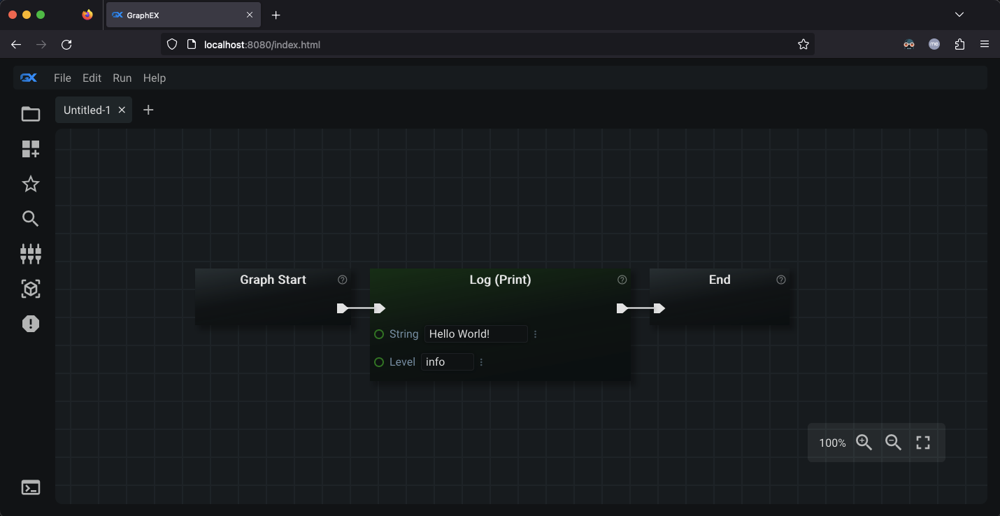

# Graphex Documentation

Welcome to the documentation for Graphex. The functionality and features of Graphex are explained here. This page is navigable using both left-clickable hyperlinks and the forward/back buttons on your browser.

This document is primarily arranged by where individual features are located in the UI. If you are looking for documentation on a specific feature of Graphex: figure out which part of the UI that feature is located at and then follow [one of the links farther down on this page](#user-interface).

## About Graphex

Graphex is a visual programming (language) application that allows you to build and execute 'graphs'. Each graph contains 'nodes' that perform different operations in the order created by the user. A fully connected graph is equivalent to a python script (or program).

You do not need any programming knowledge to use Graphex. It was designed to allow anyone to write computer programs (visually) without writing lines of code.

## Setting Up

If you are viewing this document from inside Graphex itself: this step is already done! If not, click the links below to learn how to configure and launch Graphex.

- [Installing Graphex and its Dependencies](setup/installing.md)
- [Running / Launching Graphex](setup/running.md)

## User Interface

Graphex graphs are created via a UI served from a webserver. When you first navigate to the UI, it will look like this:

The UI itself can be broken down into different areas/sections. Below you can follow links to documents that explain different areas of the UI and what they are for. Each section below assumes you have read (or already understand) the previous section's content.

- [The Editor Panel (Intro to Nodes and Graphs)](ui/editor.md)
- [The Sidebar Panel](ui/sidebar.md)
- [The Menu Bar](ui/menubar.md)
- [The Terminal](ui/terminal.md)
- [The Text Editor](ui/textEditor.md)

## More Advanced Topics

These documents talk about some of the more advanced features of Graphex.

- [Specialized Nodes](advanced/nodes.md)
- [The Execute Graph Node](advanced/executeGraph.md)
- [Data Containers, JSON, and YAML](advanced/dataContainers.md)
- [Multithreading](advanced/threading.md)
- [Configuration Files](advanced/config.md)
- [Server SSL Certificates for HTTPS](advanced/ssl.md)
- [Storing Secrets in GraphEx Using the Vault Mode](advanced/secrets.md)

## Plugin Specific Documentation

GraphEx will generate a catalogue of documentation provided by plugin developers when served. You must serve GraphEx in order for this catalogue to be generated.

- [You can find this generated document here](plugin_docs/plugins_index.html).

$warning$ External plugin code and documentation can't be verified to be safe to use by GraphEx itself. Verify that the plugin you are installing is safe before providing it as an argument to GraphEx.

## Frequently Asked Questions

Some 'FAQ' related documents:

- [General FAQ Documents](other/faq.md)
- [Version Changelog](other/changelog.md)

## Developer Topics

This document talks about how to create a plugin as a developer:

- [Creating a Graphex Plugin](other/plugin.md)
