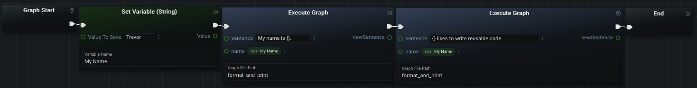
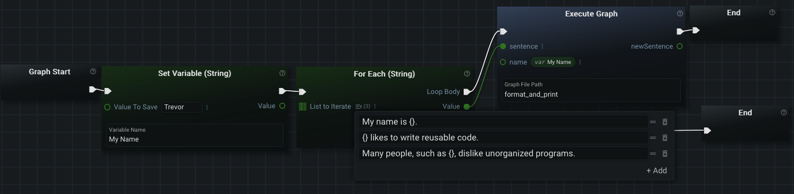

# Frequently Asked Questions

This page annotates some common FAQs for the Graphex Application.

## Can I Create My Own Nodes?

The Graphex application is written in way to allow you to create 'child' graphs (or 'subgraphs'). These are effectively the same thing as creating your own node. You can execute these graphs by using the ['Execute Graph' node](../advanced/executeGraph.md).

Graphex is also extendable by other developers. If you are familar with the python3 programming language, you can read [this document about creating a plugin for Graphex](../other/plugin.md). Please note that this particular document is not intended for the same audience as the rest of Graphex's documentation.

## Why Aren't My Graph Inputs/Outputs Appearing on the Execute Graph Node?

You probably need to refresh the node. The easiest way to do this is to right-click on it with your mouse and select 'Refresh' in the dropdown context-menu.

If the node itself is showing the color 'red' anywhere (input field, icon, sockets), then you have an error that you need to resolve.

## How Do I Keep My Graph Clean?

The best way to keep a graph looking 'clean' and minimal is by using less nodes to accomplish the same logic. One of the easiest ways to achieve that goal is by making heavy use of 'variable' nodes and the ['Execute Graph' node](../advanced/executeGraph.md). Also make use of lists when possible and iterate over them in a loop. If you haven't already, you can read about 'variable' nodes, 'list' nodes, and 'loop' nodes in [the document about special nodes](../advanced/nodes.md). By striving to make your graph 'cleaner', you are also making use of good programming practices.

The document on the ['Execute Graph' node](../advanced/executeGraph.md) gives an example graph that is a good starting point to understanding a graph that follows this 'clean' pattern. I have renamed the 'child' graph from that example to 'format_and_print'. I have added on to the example by:
- Setting my name to a variable for reusability
- Adding multiple 'Execute Graph' nodes to reuse the 'format_and_print' graph

Assume as we continue to create 'sentences' that we want to 'format and print': we notice that there is a common pattern amongst all the sentences. All of our sentences are adding our name somewhere to the sentence and printing it. We can condense a large number of sentences we want to 'format and print' into a list and then iterate over the list:

One thing to consider is that you don't always _need_ to use a variable. The first example should absolutely use a variable because your name is mentioned in more than one place in the graph. In the second example, your name is only referenced from the loop body. If this is the only place we intend to use that variable, then you should write your name into an input field on the 'Execute Graph' node instead (or provide your name as a graph input on the CLI). This saves resources on the computer that is executing your graph/program. You should also create a variable for the list of 'sentences' if they are used in more than one place.

Whether or not you should use variables and subgraphs is going to change throughout the lifecycle of developing the graph. Sometimes you don't know if a value needs to be reused yet. Going back and 'cleaning' up a graph without changing its functionality is called _refactoring_ (programming jargon).

## What Configuration File Am I Using?

The path to the current configuration file in use by the server can be found in the client UI's [Menu Bar](../ui/menubar.md) via 'Help' -> 'About Graphex'.

## Where Did My Favorite Nodes Go?

Your favorite nodes are stored in browser storage. They will only persist on the same server in the same browser. Clearing stored information in your browser cache may also delete all favorited nodes.

## Is There More Documentation?

If you have plugins installed, they may provide their own documentation pages. If any of your installed plugins have developer provided documentation, links to their documentation pages will appear on [the dedicated page for plugin documentation](../plugin_docs/plugins_index.html).

## How do I Find a Node that Does '...'

At the time of updating this document, there are well over 1000 different nodes in GraphEx. It is unreasonable to write documentation for every new node that is added. That being said, there are a couple of different places you can reference to learn about nodes:
- If you haven't already, the first thing you should do is read through all four primers on the GraphEx User Interface. The first document can be [found here, which describes the Editor Panel and introduces both the basics of nodes and graphs.](../ui/editor.md)
- [The GraphEx Document on Specialized Nodes](../advanced/nodes.md) will provide an overview of many nodes needed to control the flow of your graphs.
- Nodes provided by plugins may be documented on [the dedicated page for plugin documentation](../plugin_docs/plugins_index.html).
- You can use the search bar at the top of the "Nodes Panel" in the left Sidebar to search for a node matching a description you provide.
- You can click through the "Categories" provided by the "Nodes Panel" in the left sidebar to drill down on the node functionality you are looking for (and then browse the descriptions of each node in the category). You can read more about the "Nodes Panel" and navigating through its categories [on the page describing the The Sidebar Panel](../ui/sidebar.md).
- You can view graphs already written by others and click the "help" icon (question mark) in the upper right hand corner of each node to learn more about what it does:

[Return to Main Page](../index.md)