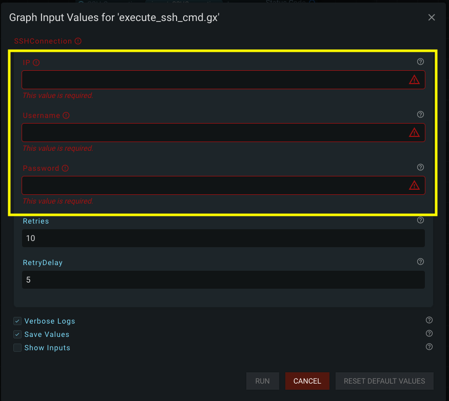

# Creating a Graphex Plugin

Graphex plugins are python3 packages. They are installed via pip and dynamically imported at runtime by Graphex. The Graphex package should first be installed on the system you are creating a plugin on (in order to import from it).

## Package Structure

The python package should have the following structure:

```
name_of_package_as_directory
├── Makefile
├── README
├── name_of_package_as_directory
│   ├── docs
│   ├──    ├── index.html
│   ├── __init__.py
│   ├── python_file_with_new_datatypes_or_nodes.py
└── setup.py
```

It is important that your package follows this structure so that Graphex can find the new classes you create in the python files you define. As long as your package follows this structure, Graphex will be able to find the classes on its own.

It is recommended you include a Makefile for the installation of your package via wheel. Here is a sample of a Makefile you could use:

```makefile
highlight = \033[1;36m
reset = \033[0m

help:
	@echo "Usage: make ${highlight}<command>${reset}"
	@echo "Commands:"
	@echo "\t${highlight}all${reset}: Build and install this plugin."
	@echo "\t${highlight}build${reset}: Build the package for distribution or installation."
	@echo "\t${highlight}install${reset}: Install the built package locally."
	@echo "\t${highlight}remove${reset}: Remove the local installed package."

all: remove build install

build:
	python3 -m build --wheel

install:
	pip install dist/*.whl

remove:
	rm -rf dist build
	python3 -m pip uninstall -y name_of_plugin_package

.PHONY: all build install remove
```

## Creating New Data Types

New data types can be added to graph by creating a _DataType_ class. Here is an example:

```python
from graphex.datatype import DataType

NetworkMap = DataType(
    true_type=dict, name="Network Map", description="A Network Map dictionary. Use action nodes to populate the map.", color="#cae8c3", categories=["MyPluginName"]
)
```

With intellisense installed in your IDE, you should be able to see the class definition on hover:

```
class DataType(
    true_type: Unknown,
    name: str,
    description: str,
    color: str,
    categories: List[str]
)
Metadata about a data type.

:param true_type: The underlying 'Python Type' for this data type. This should be either a single type (e.g. int) or a Union of types (e.g. typing.Union[int, float]).
:param name: The name to use for this type in the UI.
:param description: The description to use for this type in the UI.
:param color: The color to use for this type in the UI.
:param category: The categories under which to sort this type in the UI.
```

The 'typing' library is a standard library available in python3. It can be imported like this:

```python
import typing
```

You can use your own custom classes as the 'true_type'. The 'color' param should be three hexidecimal numbers (RGB) represented as a string and must start with the hash ('#') character.

If you want your data to be able to be 'cast' to another datatype: you will have to define the logic for each cast with a function. Here is an example:

```python
@NetworkMap.cast(to=String)
def NetworkMap_to_string(d: dict) -> str:
    temp = "Current Mappings:\n"
    for key, value in d.items():
        temp += str(key) + " : " + str(value) + '\n'
    return temp
```

The annotation associates this function with the 'NetworkMap' datatype created above and tells it that it should be allowed to be cast into a _String_ datatype. The function should then return a _String_ value.

This is all you need to do to create your own 'castable' datatype. This will not do much on its own. Read the next section for information on creating custom action nodes to take advantage of your new data types.

## Creating New Action Nodes

Action nodes are created by extending the 'Node' class in Graphex. Here is an example of a Node subclass for the datatype we created in the previous section:

```python
from graphex import Boolean, String, Number, Node, InputSocket, OptionalInputSocket, OutputSocket, ListOutputSocket, ListInputSocket
import typing

class NetworkMapAdd(Node):
    name: str = "Add Mapping to NetworkMap"
    description: str = "Associates two networks with each other. Use this node to populate a NetworkMap object."
    categories: typing.List[str] = ["MyPluginName", "Network"]
    color: str = "#cae8c3"

    nw_obj = InputSocket(datatype=NetworkMap, name="NetworkMap Object", description="The NetworkMap object to populate.")
    map1 = InputSocket(datatype=String, name="Current Network Name", description="The Network Name that already exists.")
    map2 = InputSocket(datatype=String, name="Original Network Name", description="The Network Name as expected (e.g. by an OVF File)")

    output = OutputSocket(datatype=datatypes.NetworkMap, name="Updated NetworkMap", description="The NetworkMap populated with the new values.")

    def run(self):
        nw_obj: dict = self.nw_obj
        nw_obj[self.map1] = self.map2
        self.output = nw_obj
```

At a bare minimum your subclass must have:
- The name of the node
- The category of the node
- The color of the node
- A (overloaded) run function

You can define any number of input or output sockets. Optional and list sockets are also available for you to use. I have included them in the import section of the above code block for reference.

The category list is the sequence of nesting that will appear in the UI (e.g. 'MyPluginName' gets clicked and then 'Network' would appear as a subcategory). It is strongly suggested (but not enforced) that you put all plugin code underneath its own category.

The 'run' function must be overloaded from the parent class. This is where you will include the logic that you intend for your node to perform. If desired, you can make references to functions in other files inside this run function.

### Logging from an Action Node

Your custom action nodes have access to the same logger that is used by both built-in Graphex nodes and the 'Log (Print)' action node. The logger functions are defined in the parent class. You can reach them from the 'run' function that you overload.

Here are some of the ways you can log to the output:

```python
class MyLoggingNode(Node):

    # ...

    def run(self):
        # # # logging options
        # The level can be provided via the 'level' param:
        self.log('Hello', level='debug')
        # The level param is optional, the default level is 'info':
        self.log('Hello')
        # If you don't want to use the 'level' param, you can call the specific functions like this:
        self.log_debug('Hello')
```

Logging is encouraged, especially at the 'debug' level.

### Creating a Default Constructor for Your Custom Datatype

GraphEx version 1.7 introduced the ability for developers to add default constructors to their datatypes. This is accomplished by passing in your own function to override the 'construct' function defined by the Datatype parent class.

For example, lets take a look at this SSHConnection (slightly modified but still based on a real implementation):
```python
SSHConnection = DataType(
    true_type=myPackageName.util.connect.SSHConnection,
    name="SSH Connection",
    description="An SSH connection.",
    color=esxi_constants.COLOR_SSH_CONNECTION,
    categories=["Remote Connections"],
    constructor=construct_ssh_connection
)
```

Specifically, notice the 'constructor' parameter added above. You simply need to pass a reference to a python function into this parameter. It can be a 'normal' function or a lambda (anonymous) function.

To follow along with the above example, the constructor function can be defined like this (normal function):
```python
import myPackageName
import ipaddress

def construct_ssh_connection(runtime: Runtime, info_logger: typing.Callable, ip: str, username: str, password: str):
    ipAddr = str(ipaddress.IPv4Address(ip))

    info_logger(f'Opening SSH connection using IP "{ipAddr}" and username "{username}"')
    # actually constructing the (real) object in python
    conn = myPackageName.util.connect.SSHConnection(ipAddr, username, password)

    # attempting a connection with the object
    # raising an error will end the GraphEx graph immediately (just like in an action node)
    if not conn.connect():
        raise RuntimeError(f'SSH connection could not be established using IP "{ipAddr}" and username "{username}": {str(e)}')
    info_logger(f"SSH connection OK")

    # here we create a function that can be used to disconnect from the SSH connection
    def close_connection():
        if conn._connection:
            info_logger(f"Closing SSH connection.")
            conn.close()

    # We pass our disconnect function into 'defer', which will only execute at the end of our GraphEx graph (like a deconstructor)
    runtime.defer(close_connection)

    # We return the object that we want ourselves or others to use in action nodes
    return conn
```

As you may have expected: the function (shown above) we pass into the 'constructor' parameter when creating our datatype contains a function that creates a 'SSHConnection' object, handles connecting to the target machine, and returns the object with the active connection. The 'ip', 'username', and 'password' parameters in this example are simply used to create the SSHConnection object itself. The 'info_logger' parameter is a function (typing.Callable is what was used to indicate that this was a function) that the constructor can use to log to the built-in GraphEx logger. This functionality and the 'runtime' parameter are both optional, but are explained in the next section.

Providing a (GraphEx) Runtime object to your constructor allows you to handle the deconstruction of your object automatically when your object is destroyed by GraphEx. In the above example, a 'close_connection' function is defined inside the constructor that is passed to 'runtime.defer()'. Any function that is passed into GraphEx via 'Runtime.defer()' is automatically run at the end of the runtime. In this particular case, the SSHConnection object has the opportunity to gracefully disconnect from the machine its connected to before the object is destroyed.

### Constructing Your Custom Datatype

If you followed along in the previous section, you should now have a custom constructor function added to your custom Datatype. The function you passed into your Datatype can simply be invoked like a static function on a Class:

```
# add your arguments to the construct function to match the sequence they were defined
SSHConnection.construct(...)
```

There are two specific use cases where you would want to use a constructor:
1. Creating your datatype in one or more action nodes
2. Creating your datatype using the CompositeGraphInput feature of GraphEx (version 1.7+)

Since there are multiple places your object could be constructed, it made sense for you to define the construction of your object in your Datatype so you can recreate it in many places without duplicating the creation code. The next two sections will provide examples on how to do these things.

#### Construction of a Custom Datatype in a Node

Following along with our 'SSHConnection' object, lets construct our object in an action node and provide it to the user via an OutputSocket on the node. For this example, it makes sense for us to have an 'Open SSH Connection' node:

```python
from graphex import Boolean, String, Number, Node, InputSocket, OptionalInputSocket, OutputSocket, ListOutputSocket, ListInputSocket, VariableOutputSocket
import typing
from myPackageName import datatypes

class OpenSSHConnection(Node):
    name: str = "Open SSH Connection"
    description: str = "Open an SSH connection to a host."
    categories: typing.List[str] = ["Remote Connections", "SSH"]
    color: str = esxi_constants.COLOR_SSH_CONNECTION

    # input sockets
    ip = InputSocket(datatype=String, name="IP", description="The IP to connect to.")
    username = InputSocket(datatype=String, name="Username", description="The username of the user to login as.")
    password = InputSocket(datatype=String, name="Password", description="The password for the user that is logging in.")

    # output sockets
    # A VariableOutputSocket is simply a normal OutputSocket but it allows your user to immediately save the output to a local variable in the Graph
    connection = VariableOutputSocket(
        datatype=datatypes.SSHConnection,
        name="SSH Connection",
        description="A reusable SSH connection to execute commands over.",
    )

    # 'log_prefix' is a function you can override from the base 'Node' class that changes the text shown to the user in the logger before your actual log messages appear
    # For example: the 'Open SSH Connection' node will appear as [Open SSH Connection - x.x.x.x] (where x are the octets of the IP being connected to)
    def log_prefix(self):
        return f"[{self.name} - {self.ip}] "

    # Remember that the run function is what GraphEx will actually execute on your behalf
    def run(self):
        # Here we simply call our constructor and assign its returned value (the object) to the OutputSocket !
        self.connection = datatypes.SSHConnection.construct(self._runtime, self.log, self.ip, self.username, self.password)
```

As promised, you can see where the 'Runtime' and "Logger" references from our constructor get passed in here. The node has a reference to the 'Runtime' object that you can pass in via 'self._runtime'. You can pass the appropriate log levels to your function by passing in the node's 'self.log' function and using from inside your constructor.

#### Composite Graph Inputs and Running Graphs With Objects as Inputs

The other way you will find constructors useful is in providing users with the ability to run Graphs that contain your object as an input. Take for example our 'SSHConnection' object. Imagine we create a 'main' graph (parent, top level) that uses our 'Open SSH Connection' node (shown above) to create a SSH Connection. It is perfectly reasonable to assume that we will have one or more subgraphs that run certain commands over our custom SSH connection Datatype. It would be a waste of time and resources to attempt to reconnect each time we want to use our connection to execute a command. This is why we created our object once at the 'top' level and then pass the connection down into subgraphs as they need them to perform operations over that connection.

This hierarchy of graphs works great until you want to run one of the subgraphs. By default you can't run a graph in GraphEx if it requires an object as an input. This is because GraphEx doesn't know what your object needs in order to create and run it (imagine your object requires additional objects to init or, like our 'SSHConnection' example, needs to be configured to connect to another machine before giving it to a user). In GraphEx version 1.7.0 we gave *you* the ability to override this behavior!

Composite Graph Inputs are a way of defining what primitive data your object needs in order to be constructed. You can ask for as much primitive data as you need, but no objects can be added to your definition. The primitives that you define to be used to create your object are then provided to the user to be filled out when they try to run a graph using your object as an input in the UI:



Hopefully, you are starting to connect the dots as to why a 'construct' parameter was added to the 'Datatype' class. You can use the same constructor between your nodes and your Composite Graph Inputs! In the image above, you will see the user has to enter the primitive data for 'IP', 'Username', and 'Password' in order to construct a 'SSHConnection'. This is all abstracted away from the user, all they need to understand is what fields to fill in to run the subgraph. You will also see 'Retries' and 'RetryDelay' which have default 'Number' values that the user can tweak when making connection attempts (this wasn't shown in previous examples (this is the real deal!)).

Creating a CompositeGraphInput is just as simple as creating a Node or a Datatype. You create a class that inherits and GraphEx will automatically find it in your plugin. For simplicity (and to match the previous examples) I have removed the 'Retries' and 'retryDelay' fields as shown in the image above:

```python
from graphex.compositeGraphInput import CompositeGraphInput, subGraphInput, subGraphListInput, subGraphEnumInput, subGraphEnumListInput

class SSHConnectionInput(CompositeGraphInput):
    # Override the 'datatype' variable here with the instance of your custom Datatype that GraphEx uses
    datatype = SSHConnection

    # Define the fields just like you were creating a Input or Output socket in node, but use the 'subGraphInput' class instead
    ip = subGraphInput(name='IP',datatype=String,description="The IP of the machine to connect to.")
    username = subGraphInput(name='Username',datatype=String,description="The username of the user to login as.")
    password = subGraphInput(name='Password',datatype=String,description="The password for the user that is logging in.")

    # Override the 'constructInput' function just like the 'run' function when creating a node
    # Notice we are reusing the 'construct' function we wrote earlier!
    # We return the object created by our constructor for the GraphEx runtime to use
    def constructInput(self):
        return SSHConnection.construct(self._runtime, self._runtime.logger.info, self.ip, self.username, self.password)
```

Access to the 'Runtime' object here is the same as in a node. A little bit different is your access to the 'Logger'. Notice that since this Class isn't directly executed by GraphEx (a Node IS directly executed), it doesn't have access to a logger by default. You can give it a logger by pulling the function that you want from the _runtime's logger (self._runtime.logger). It is not recommended to use the 'Runtime' object's 'Logger' unless you have to (such as in a situation like this). Normal nodes should use their own built-in loggers to make it easier to track where log messages are coming from.

## Custom Exceptions

You can raise exceptions from action nodes in the 'run' method. These will be handled properly by Graphex and appear in the output in the same way as 'vanilla' Graphex nodes.

If raising exceptions, it is recommended you create custom exceptions. Custom exception messages make it easier for users to troubleshoot what went wrong with their graph. It also makes it easier for everyone to debug which plugin is raising the error.

Here is an example of how we have been writing custom exceptions for our plugins:

```python
# We house the custom exceptions for each plugin in a file called 'exceptions.py'

class GraphexPluginNameException(Exception):
    """Base class for all Graphex PluginName exceptions."""
    pass

class PluginNameConnectionFailedError(GraphexPluginNameException):
    """
    Raised when an instance fails to connect to PluginName's resource.

    :param err_msg: The error message.
    """

    def __init__(self, err_msg: str):
        super().__init__(f"Failed to open connection to PluginName server: {str(err_msg)}")

# ... etc.

# # #
# Then we reference the exceptions from the files that contain action nodes:
class MyNode(Node):

    # ...

    def run(self):     
        raise exceptions.PluginNameConnectionFailedError('This string gets passed into the error message')
```

## Plugin Specific Documentation

As shown in [the Package Structure section at the top of this page,](#package-structure) custom documentation can be added to your package for usage by GraphEx users. In order to accomplish this, your pip package must EXACTLY match the path structure: "name_of_package_as_directory" -> "docs" -> "index.html". You may include as many html files as you wish, but they must all be reached via relative path from your "index.html" file.

### Adding Documentation to Your pip Package

The (GraphEx) supported way of getting your documentation into your pip package (in the proper structure) is to add python code to your setup.py file. Start by placing your index.html file in [the structure shown at the top of this page.](#package-structure) Then open up your setup.py file and add the following function to the top of it:

```python
import os

def get_package_data():
    ROOT_PATH = os.path.abspath("./name_of_your_package")
    DOCS_PATH = os.path.join(ROOT_PATH, "docs")
    files = []
    for directory, _, filenames in os.walk(DOCS_PATH):
        for filename in filenames:
            path = os.path.join(directory, filename)
            path = path[len(ROOT_PATH) :].strip("/")
            files.append(path)
    return {"name_of_your_package": files}
```

Then reference this function in the setup() function and add the 'include_package_data=True' flag to it:

```python
setup(
    name="name_of_your_package",
    ...
    package_data=get_package_data(),
    include_package_data=True
)
```

If you followed the instructions at the top of this page and created a "Makefile" to control the building of your plugin: your docs will now be added to your pip package each time you execute "build":
```makefile
...

build:
	python3 -m build --wheel

...
```

### Stylizing Your Documents

You are free to use your own CSS when stylizing your plugin documents. By default, no CSS will be applied to your HTML files. If you wish to use the same CSS as the GraphEx documentation, the only way recommended to do it is to copy the "graphexStyle.css" file from the GraphEx repository (located at graphex/docs/markdown/graphexStyle.css) and reference this file in your html files.

While it may be possible to use relative pathing to reference the *exact* same CSS sheet that GraphEx uses, it is not recommended as your files will still have no CSS applied to them when viewed from outside GraphEx.

[Return to Main Page](../index.md)