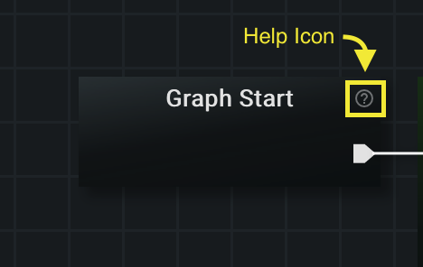
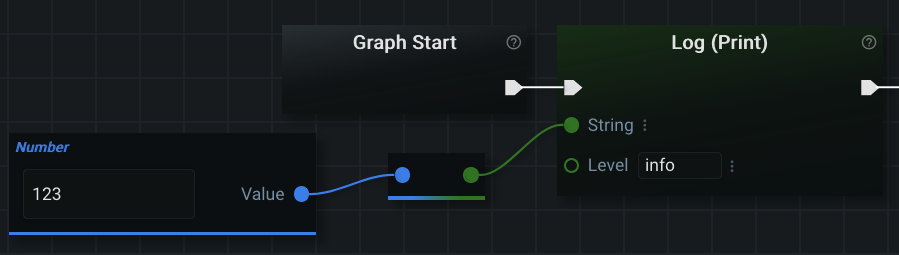

# Editor Panel

The editor panel is the heart of graphex. This is where you will be building graphs using nodes. The location of the editor panel is shown in the image below.

## Overview of a Graph

When you first open Graphex, you will already have a complete graph waiting for you:

A graph consists of individual nodes connected into a linear sequence. Each node has its own function that it performs. Connecting nodes together lets you create programs that perform more complex tasks.

There are three nodes in the graph shown: 'Graph Start', 'Log (Print)', and 'End'. Every graph must have a 'Graph Start' node to indicate the start of the program. Likewise, every graph must have at least one 'ending' node to mark the end of the graph (the 'End' node is most commonly used). The 'Log (Print)' node outputs text to the screen. Here the textbox was pre-populated with 'Hello World!' (which will be displayed in the output window when this graph is run).

There are many, many nodes in Graphex. At least one to accomplish every function or operation you could perform in the python programming langauge. In addition to this, plugins add their own nodes to perform specialized functions and extend the usability of Graphex.

Since there are so many possible nodes, it would be impossible to write and maintain a document describing what each one does. In light of this, nodes have several ways of telling you what they do.

You can get a description of what a node does from the Editor Panel by hovering over the help icon:

When hovering the icon a description will appear:

All the nodes in a graph must be connected linearly from 'Graph Start' to an 'ending' node. The lines that connect two nodes together are called 'links' and the pentagon shaped arrows that they connect to are called 'link sockets'. 

You can change which nodes are connected to each other by left-clicking on a link socket. This will 'grab' the current link and let you click it onto other link sockets as a connection. If a node only accepts one link socket, you can also click on the node itself to connect the link to it.

You will notice that when you disconnect a node, the application will visually alert you to an errors in the graph. Red boxes will pulse around the erroring nodes and red error icons will appear next to the sockets that are missing connections.

The program will not allow you to run/execute a graph with errors. Just like the help icons, hovering the red error icons will give you a description of the problem:

We explain nodes themselves in more detail [farther down this page](#node-types-and-fields). For now, read on about how to navigate the editor itself.

## Navigating the Graph

You can move around the editor by holding down the left mouse button on the grid itself and moving the mouse around. There is no theoretical limit to the size of a graph (constrained only to memory limitations).

Nodes can be moved around in the same way. Hold down the left mouse button on node and move the mouse around.

As mentioned above in [the graph overview](#overview-of-a-graph), links/connections can be moved by left-clicking on the link socket (do not hold down) and then clicking again to either connect the link to a new node or discard the link.

You can zoom in and out of the graph using the middle mouse button. Additionally, there is a navigation bar in the lower right corner of the editor that displays (in order) your current zoom level, a 'zoom-in' button, a 'zoom-out' button, and a fullscreen button.

You can right-click on various parts of the Editor Panel to create dropdown (context) menus with more options for the particular part that you right-clicked on.

For example, right-clicking on a node creates a dropdown (context) menu that gives you different options you can perform on a node:

You can double-click a node to select it in the editor. All selected nodes are displayed with a dashed border around them:

Selected nodes will always have a dashed (non-solid) border around them. The color of the border will change to red if the selected nodes also have an error.

You can select many nodes at once by holding down both the 'Shift' key on your keyboard and the left mouse button and dragging the mouse selection across multiple nodes.

There is a special context menu available to selected nodes. It is available by right-clicking on an 'empty' (non-node) part of the background and selecting the option for 'Selected Nodes (#) >'.

You can delete nodes in the graph either from the right-click context menu or by pressing the 'delete' key on a selected node (fn+'delete' on Mac).

## Editor Tabs

At the very top of the Editor Panel you will find 'tabs' for each open graph in the editor:

Each tab displays the name of the open graph. If the graph is saved to a file on the server, then the relative path (from the root directory provided to Graphex on the CLI) will be displayed next to the name of the graph (in a grey text).

You can rename the currently opened graph by double clicking on the current name on tab. Alternatively, you can rename the tab by opening a context-menu (right-click the tab) and choosing the 'rename' option.

Pressing the 'Plus' (+) button on the editor tabs bar will create a new 'untitled' graph. This is the same graph you see each time you open the Graphex UI.

Pressing the 'X' button next to each tab will close the graph corresponding to that tab in the editor. If you have unsaved changes, the 'X' button will instead be a white, filled-in circle (notifying you of unsaved changes). Hovering the circle will return the symbol to an 'X' and clicking on the 'X' will result in a pop-up message confirming that you want to close an unsaved graph.

The Graphex application requires that at least one graph be open at any given time. Closing the last open graph will result in the default graph appearing again in the editor.

## Node Types and Fields

The two primary types of nodes that you will encounter in Graphex are 'Action' and 'Data' nodes. In most cases, you aren't going to have to remember the distinction. They are documented below for your general understanding.

This section is going to describe what various nodes look like and mean in the context of the Editor Panel. This section is not going to describe how to add nodes to a graph. Adding nodes to a graph is explained in the [next page: the Sidebar Panel](sidebar.md).

### Data Nodes

Data nodes don't perform any action. They simply contain data that you want to pass into other nodes.

The three data nodes that come 'vanilla' (by default) with Graphex are primitive data types from the python programming language.

Here I have added all three (default) data nodes to the editor:

You will see that each node clearly describes its data type at the top of the node: _String_, _Number_, or _Boolean_. A string (programming jargon) is simply a collection of characters put together (letters, numbers, punctuation, etc.). A number can be either an integer or a decimal number (also known as floats or doubles). A boolean is a value that can only be true or false.

You can change the value a data node holds by left-clicking on the input field (box) on the data node and typing in whatever you would like the data node to hold. Note that _Number_ nodes will display a visible error if you type non-number characters into them.

Different data types are color-coded differently by convention in Graphex. Each data node is always the color of the data type it represents. Strings are always that shade of green, numbers always blue, and booleans always red.

$warning$ The coloring convention is not always the same for action nodes.

You may have also noticed that data nodes are 'missing' link sockets. This is because they have no impact on the 'flow' of a graph. Their only function is to be taken as inputs to action nodes.

Data nodes do have a different type of socket that we have not described yet. They are called 'Data Sockets'. This is how you connect them to action nodes. Each connection represents a one-way transfer of the data in the data node to the action node. Since the action node is the node 'ingesting' the data: outputting data sockets can be 'ingested' by more than one action node at a time.

Notice that these sockets are represented by circles containing the color of the data type. On the data nodes themselves: the color will match the overall color of the data node. On action nodes: the color represents what data type (or node) is able to connect to it. Most of the time, the data types have to match in order to connect them together ([this is discussed further below in the section on type casting](#type-casting)).

Data nodes also have names next to them to describe what type of data is either being created (on a data node) or expected to be ingested (by an action node). As per usual, you can hover either the data socket or the name of the data socket to get more information about it:

Every data socket you hover will give you a description of what the data is (on a data node) or or what is expected of the data (on an action node). It will also tell you what type of data it is expecting (_String_, in the above image).

You connect data sockets in the same way that you connect link sockets: left-click on the socket once to create a connection and then click again on the data socket you want to accept that connection.

Take a look at the 'Log (Print)' action node in the default graph created for you by Graphex. It contains two data sockets that accept strings. You can hover those data sockets just like the singular one on the data node.

In the image below I have created a data node (New String). I gave it a value by typing 'Cats are great' into the input field. Finally, I connected that value ('Cats are great') to the 'Log (Print)' action node by clicking the data socket on the data node and then clicking the data node on the action node. This caused the program to draw a green connection line from the data node to the action node.

Notice that the 'Hello World!' string disappeared from the input box on the action node ('Log (Print)'). It's value was replaced by the data input we created. If we were to run this graph, the output would now be 'Cats are great'. We will talk more about the different types of inputs to action nodes in the next section.

Finally, inputs can be chosen from enumerated types as illustrated below. This can be seen by the dropdown arrow within the ‘Level’ input. Clicking on this input produces a set of options to choose, in this case ‘info’, ‘debug’, ‘notice’, ‘warning’ and 'error'.

The final thing to remember about data nodes is that they are commonly extended by plugins. While there are only three 'default' (primitive) data nodes, software developers frequently create new data types to represent more complicated types of data (e.g. data objects that represent virtual machines). These more complicated data types (objects) are constructed via action nodes in the plugins we have written so far. This makes it easier to convert primitive data into complicated data. These complicated types can then be reused over and over in specialized action nodes added by the plugin.

$note$ Ideally, new data nodes/types created by plugins have different colors from the normal data nodes. Having many plugins installed will increase the likelihood of 'color overlap'. Ultimately, this has no effect on the operation of the program (the colors are for us humans). Remember, you can always hover the data socket if you aren't sure what type of data to connect to it.

#### Type Casting

Sometimes it makes sense to convert one data type into another. A good example of this is the 'Log (Print)' action node. What if you want to print out a _Number_ datatype? The mechanism of converting one type to another is called 'Type Casting'.

Cast nodes are a special type of node in Graphex. They convert one type to another. I've added four cast nodes to the editor in the picture below:

They are intentionally designed to be minimal. This helps give the graph a cleaner look. The socket color identifies which data types are being converted. Just like data and action nodes: the data sockets on a cast node can be hovered for more information (e.g. if you need an explicit reminder of the type).

In the image above, the following cast nodes are shown:
- Number to String
- String to Number
- Boolean to String
- String to Boolean

$warning$ Graphex will not stop you from trying to convert things that don't make sense. You may not get an error while creating the graph, but you will get an error when running the graph (e.g. trying to convert a string with words into a number).

You don't have to search for which cast nodes are available. If the conversion you are trying to do is possible, then the developer has probably implemented a cast node for you. Start by trying to connect together the data types you think should be compatible:

Graphex will automatically find the correct cast node for you and connect everything together:

Now the number '123' will be outputted to the screen when the program runs.

Remember that not every data type will be able to convert into another. You may have to use an action node to convert your types instead. For debugging purposes, it is fairly normal for any data type to be converted into a _String_ for printing/logging to the screen.

### Action Nodes

Action nodes are nodes that perform some action. In most cases, they accept some type of data as input to their action. They may also produce new data as output. Action nodes are equivalent to functions in mathematics and programming.

There are hundreds of action nodes in Graphex and plugins can add hundreds more. They will not all be explained here in the documentation. You will learn how to find, search, and add nodes in the [next page: the Sidebar Panel](sidebar.md). There is a description for what each action node does in the Sidebar Panel.

In the default graph that appears when Graphex starts, the 'Log (Print)' node is an action node. The data you provide is what you want outputted to the screen and what logging 'level' you want that message to appear at. The 'Log (Print)' action node has no output data sockets.

If you haven't already, please [read the section above on data nodes](#data-nodes) to get introduced to the basic way that action nodes receive data type inputs through data sockets.

Action nodes aren't restricted to individual data types like data nodes are. Lets take a look at a different action node that has a combination of different data types:

The 'Write String to File' node shown in the above image expects two strings as inputs: the _String_ to write to the file and the path to the file to write to on the file system. It also has a _Boolean_ data socket asking you if you want to append to the file. Hovering the 'help icon' in the upper right hand corner will explain to you that if append is 'False', then an existing file will be overwritten.

There is also an output data socket (of datatype _Number_) for how many characters were written to the file. This acts as confirmation from the file system that all the data you requested be written was actually written. Output data sockets on action nodes can be used in the same manner as the output data sockets on data nodes (sockets always function the same, regardless of what kind of node you find them on).

Notice the action node's color is a mustard yellow. This is the standard color for file operation nodes in Graphex. At a glance you can infer that any node with a similar color is related to file system operations. As mentioned in the [data nodes section](#data-nodes), the color of an action node doesn't have to match the data type sockets it has.

#### Action Node Input Fields

In [the section above on data nodes](#data-nodes), we learned about one kind of input to an action node: the socket connection. There is in fact four different ways that you can provide input data to an action node:

- Data Socket Connection
- Input Field
- Variable
- Graph Input

You can see these visually by clicking on the input selection dropdown menu icon:

Left-clicking it reveals your current input options in a dropdown. Both unavailable and the currently selected option will be greyed out:

The default for the 'Log (Print)' action node is 'Input Field'. Those are the boxes that you can type into directly on the node (or a dropdown list if the data socket expects an enumeration (enum)). These can be useful for inputting values that you only use once in a graph. The graph looks cleaner if there are less nodes in it. The 'Input Field' option is greyed out because it is currently in use.

Changing the input type to 'Connection' will cause the action node to await a socket connection. It will error until you connect a socket connection (or change the input to a different type):

In earlier examples, when we connected a data node to the action node: the socket type automatically changed to 'Connection' for us. If a connection is already present and you change the input to a different type: it will disconnect the connection automatically.

The 'Variable' option is similar to local/global variables in programming (their scope is always the current graph). Likewise, the 'Graph Input' option is similar to using arguments provided by the user on the CLI (Command Line Interface). When they are available as inputs to your current node, they will have a second dropdown available to you in the menu:

The available options in the second dropdown (for both 'Variable' and 'Graph Input') will always be specific to the type of the data socket. Graphex will not allow you to input the wrong type (it simply won't appear in the list of options). We can infer from the picture above that the variable 'My Variable' is of type _String_, because that is the only data type that is accepted.

Like the 'Input Field' option: the 'Variable' and 'Graph Input' options are available to both encourage reuse of data and to clean up the appearance of the graph (reduce the number of nodes).

We will learn more about 'Variables' and 'Graph Inputs' in the next section on the Sidebar Panel. Both 'Variable' and 'Graph Input' **nodes** are an advanced topic that you should read about lastly in [the section on specialized nodes](../advanced/nodes.md). Typecasting these types of inputs can not be done automatically. You will have to first use the specialized nodes for variables and graph inputs. These special nodes have normal data output sockets that _will_ automatically create type casting for you (if available for that data type).

## Python Virtual Enviroment and Git Branch Information

Underneath the editor panel, at the very bottom of you page, you can see the current python Virtual Environment (venv) and information on the current git branch being used:

The text shown inbetween the parenthesis is the current venv in use. The text shown after the closing parenthesis is the git branch detected in the GraphEx 'root' directory being served by the server.

## Moving On

It is recommended you next read [the section explaining the Sidebar Panel](sidebar.md). This section will teach you about inserting nodes into the graph.

[Or, Return to Main Page](../index.md)