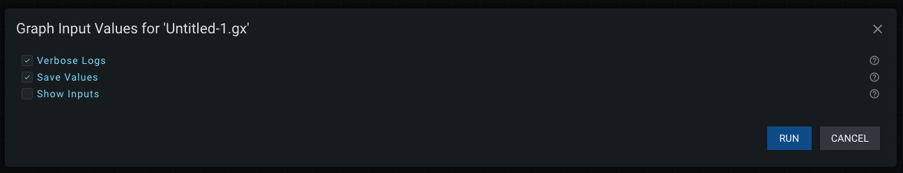
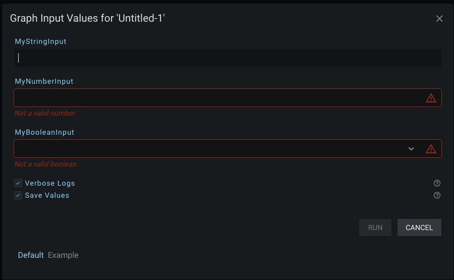
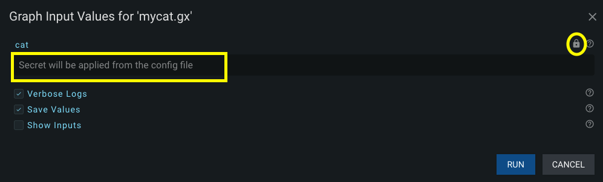

# Menu Bar

The Menu Bar is a horizontal collection of clickable dropdown menus located at the top of the screen.

There are currently four left-clickable options on the Menu Bar.

- File
- Edit
- Terminal (Previously was called 'Run')
- Help

Additionally, there is [an error icon](#connection-error-icon) that appears on the right side of the Menu Bar when there is a connection issue with the server.

You can left-click with your mouse any of the Menu Bar options to create a dropdown list of performable operations. Operations you can currently perform are displayed in white text. Keyboard shortcuts (keybinds) for those operations are displayed to the left of each option (if available). If an operation is currently unavailable (for any reason), it will appear in a 'greyed out' text color.

Many of the operations in the File Menu are dependent upon a current connection to the server. If your connection is lost: you will need to attempt to diagnose the cause of the server disconnect before continuing. If you have unsaved changes **DO NOT REFRESH THE PAGE**. You can save your changes when the server connection is re-established. The only benefit to refreshing your page after a server disconnect is to apply any new updates to your client.

$note$ You may have to provide SSL Certificates that are provided to GraphEx server each time serve it in order to have the benefit of saving changes after a disconnect occurs. You can [read about how to do that on this page.](../advanced/ssl.md). Certificates should be managed automatically for you in the current version of GraphEx.

## File Menu

The File Menu option handles common operations dealing with files.

### Save

The 'Save' option will save the 'active' (currently open) graph in the Editor Panel to a graph file (.gx extension) _on the server itself_. The save location (directory) will be the 'root' directory argument given to Graphex when the server was started. The filename will be the name shown on the current tab in the Editor Panel.

Graphex will not allow you to save a file if the current name in the editor starts with 'Untitled' or matches another filename on the server. Rename the graph via the editor tab and then try saving again.

See the 'Download' option below if you want to save the file to your computer instead of the server.

### Download

The 'Download' option will export the currently opened graph to the machine that you are using (not the server). The way the download itself happens is dependent upon your browser and the settings you have configured for the browser (e.g. whether not a dialog appears to choose where you want to save to).

See the 'Save' option above if you want to save the file to the server instead of downloading it to your local machine.

### Refresh Files

The 'Refresh Files' option will refresh/update the Files Sidebar Panel's file/directory list to match the current structure on the server itself. There is no difference between this menu option and the 'refresh button' on the Files Sidebar Panel itself.

You will want to refresh the file listing anytime that you make changes to the 'root' directory that Graphex is referencing. Otherwise, Graphex will not see the changed files/directories.

### New Graph

The 'New Graph' option will open a default 'Untitled' graph in a new tab. There is no difference between this option and pressing the 'plus' ('+') button on the Editor Panel Tabs bar.

### Open File

The 'Open File...' option lets you open a graph file (.gx extension) from your local machine (client) on the server. The modal that opens to let you choose the file to upload and open is specific to your operating system.

Opening files that are located on the server is done via the Files Sidebar Panel. Change the 'root' directory provided to Graphex 'serve' in order to get a different file listing in the sidebar.

### Open Log File

The 'Open Log File...' option will create a popup modal allowing you to select a previous log file to open in the Terminal Panel.

The previous twenty executions on the Graphex server are saved to the logs. Any log file that exists on the server for a run older than '20 runs ago' is deleted when the '21st' run is executed.

Log files are saved to the Graphex 'root' directory under a subdirectory called 'logs'. Each log file is saved as a combination of the name of the graph and the unix timestamp at the time of execution.

From left to right the 'Open Log File...' modal displays four columns:
- The name of the graph that was executed
- The Unix timestamp at the start time of execution for the graph
- The date the graph was run (extracted from the Unix timestamp)
- The time the graph was run (extracted from the Unix timestamp)

The timestamp saved to the server is based on the server's time reference. If you notice a difference between the log file's time and your local system's time: it is probably an issue with the server's timekeeping.

Hovering any 'row' of log data in the modal will highlight the current selection in a blue color. Left-clicking the 'row' will open the log in the Terminal Panel.

More information about logs can be found in [the document about the Terminal Panel](terminal.md).

## Edit Menu

The Edit Menu handles options that pertain to making edits to the currently open (active) graph in the Editor Panel.

### Undo

The 'Undo' option reverts the last change you made in the graph to the previous state of the graph.

### Redo

After an 'Undo' action, a 'Redo' action will apply the change you just made (once again) to the graph.

### Cut Nodes

When one or more nodes are selected in the graph: The 'Cut Nodes' option will remove the selected nodes from the graph and add them to the 'clipboard' of nodes to be pasted again later.

Any connections that used to exist to the 'cut' nodes will be severed (disconnected).

### Copy Nodes

When one or more nodes are selected in the graph: The 'Copy Nodes' option will add the selected nodes to the 'clipboard' of nodes to be pasted again later.

### Paste Nodes

When one or more nodes have been added to the 'clipboard' of nodes: the 'Paste Nodes' option will add the nodes in the 'clipboard' back into the currently selected (active) graph.

### Toggle Node Comments

This option can be used to toggle nodes "commented out" in the graph between their "commented out" state and the node themselves. This is similar to functionality you would find in the application: VS Code.

### Select All

The 'Select All' option will select every node in the current graph.

### De-select All

The 'De-select All' option will 'remove' the 'selection status' from every node in the current graph. No nodes will be selected afterward.

### Toggle Minimap

This option can be used to turn the minimap shown in the editor panel between "on" (show) and "off" (hide). Turning the minimap off can improve performance slightly on machines struggling for video compute resources.

### Auto-Format

This option can be used to attempt to automatically arrange the nodes in your graph in a visually appealing way.

## Terminal Menu

The Terminal Menu lets you modify the run/execute status of the current (active) graph in the Editor Panel.

### Run Current Graph

The 'Run Current Graph...' option allows you to run a Graphex graph/program from the Terminal Panel. Left-clicking the dropdown option will create a popup modal allowing you to configure the values for all the graph inputs to this graph.

If running the default graph, you will see a barebones modal:

The 'help icons' can be hovered for more information on each option in this modal.

The 'Verbose Logs' checkbox toggles on/off any 'Log (Print)' action nodes that have 'debug' selected as the level. Check the box if you want to see 'debug' logs from both your own 'Log (Print)' nodes and action nodes that output additional debug information (checked by default).

The 'Save Values' checkbox toggles on/off the ability to 'remember' your previous run options. This option is checked by default (this doesn't particularly matter if you have no graph inputs to configure).

The 'Show Inputs' checkbox toggles on/off the logging of the Graph Inputs provided to this graph before it executes. This can be useful for debugging and for a record of how to duplicate an execution again in the future. Graph Inputs specified to be hidden will not be displayed in this log message and will instead have their contents replaced with asterisk ('*') characters equal to the length of the hidden string. Likewise, encrypted secrets will have their contents replaced with the string: 'ENCRYPTED_SECRET'.

Click the 'RUN' button to run/execute the current (active) graph in the Terminal Panel.

#### Running With Graph Inputs

As your graphs start get more complex, they will start to include graph inputs. Review the creation of graph inputs in [the sidebar document](sidebar.md) if you don't remember how to create them.

I'm going to create a _String_, _Number_, and _Boolean_ graph input in the sidebar panel. Then I am going to create an additional _String_ graph input under a different category. Afterward, the run modal will look like this:

Notice how each graph input you create appears in the same sequence in the Run Modal. Graph inputs that weren't provided default values will have to be filled in before the 'RUN' button will be clickable again (these are the same inputs that will need to be provided on the CLI in order for the program to execute). _String_ and _Number_ fields will have text box values that you can type their values into. _Boolean_ fields are dropdowns for you to select either 'True' or 'False'.

_String_ fields that were configured to be hidden will appear as password inputs instead of plain text. A clickable 'eye' icon appears in each of these fields to toggle the visibility of the text:

If a description is provided to a graph input, a 'help icon' will appear next to each graph input. On hovering the help icon you will receive the description:

Since I specified at least one category while creating graph inputs: a row of selectable tabs will appear at the bottom of the modal. The 'Default' category is always created to contain options that don't have categories manually specified. 

Hovering each grey text category will change the color of the text to white and underline the option in blue:

Left-click on a category to move the modal to that page of graph inputs. Here we have displayed the other graph input I created:

Once all values are filled in properly on all pages: the modal will let you run/execute your graph.

### Encrypted Secrets

Different from strings that were configured to be hidden by the sidebar panel: Secret values detected from the configuration file will be displayed uniquely in this run modal. The value is intentionally not able to be viewed from the UI:

You can learn more about secrets in [the dedicated document on them](../advanced/secrets.md).

### Cancel Run

When the currently selected graph (in the Editor Panel) is running/executing: the 'Cancel Run' option will force the execution of the running graph to end. For more information on cancelling/quitting/killing graph processes, see [the document on the Terminal Panel](terminal.md).

### Toggle Panel

This option simply opens/closes the Terminal Panel at the bottom of the page. This is the same functionality as left-clicking the 'terminal icon' in the lower left-hand corner of your screen.

## Help Menu

The Help Menu contains a collection of options to assist you with Graphex.

### About Graphex

The 'About Graphex' option will open a popup modal displaying information about the Graphex application itself.

There are five sections to the window:
- The current name and version of the Graphex python module (the application itself)
- The path to the currently loaded [configuration file](../advanced/config.md) or a (white text) message notifying you of no currently loaded configuration file
- The current python virtual environment (venv) in use by the GraphEx server instance (if a virtual environment is being used)
- The current git branch for the 'root' directory provided to the GraphEx server when it was served (if git is detected in that folder)
- A list of all plugins currently loaded into this instance of the Graphex application or a (red text) message notifying you of no currently loaded plugins

### Find Erroring Node

The 'Find Erroring Node' option opens a popup modal allowing you to search for a runtime error in a node in the current (active) graph.

This feature is primarily used to find erroring nodes identified in log files. When an graph fails to complete its execution, Graphex provides a link to the node that failed (if possible). This link is clickable in the Terminal Panel. Later, when the output becomes a log (and external to the application itself) Graphex converts the clickable link into a 'Graphex Error Code' instead.

This 'Graphex Error Code' can be provided to this modal to try and search for the node that failed in a previous run. The graph that failed needs to be the current (active) graph opened in the Editor Panel for this modal to succeed. It is also recommended that the graph (nodes in the graph) are unedited from when the error originally occurred (but not manditory for this feature to work).

If successful, the modal will close and navigate your Editor Panel camera to be centered on the failing node.

If unsucessful, a popup message will appear informing you that it couldn't find the erroring node. It will also provide the name of the graph that originally had the error (to help you in locating the erroring graph).

### Documentation (Tutorial)

The 'Documentation (Tutorial)' option opens this document in another tab of your current browser.

## Connection Error Icon

If your client (local machine) loses connection to the Graphex server, this connection error icon will flash in the far right-hand corner of the Menu Bar:

This flashing, red connection error icon will persist until the connection is re-established with the server. The icon will disappear when you have a stable connection.

Note that any operation that depends on the Graphex server will fail while this icon is present (file system, running graphs, etc.).

## Moving On

The final document in the overview of the UI is [the document on the Terminal Panel](terminal.md).

[Or, Return to Main Page](../index.md)