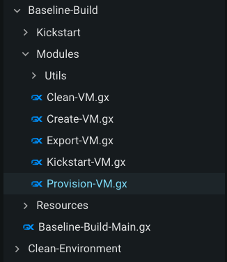
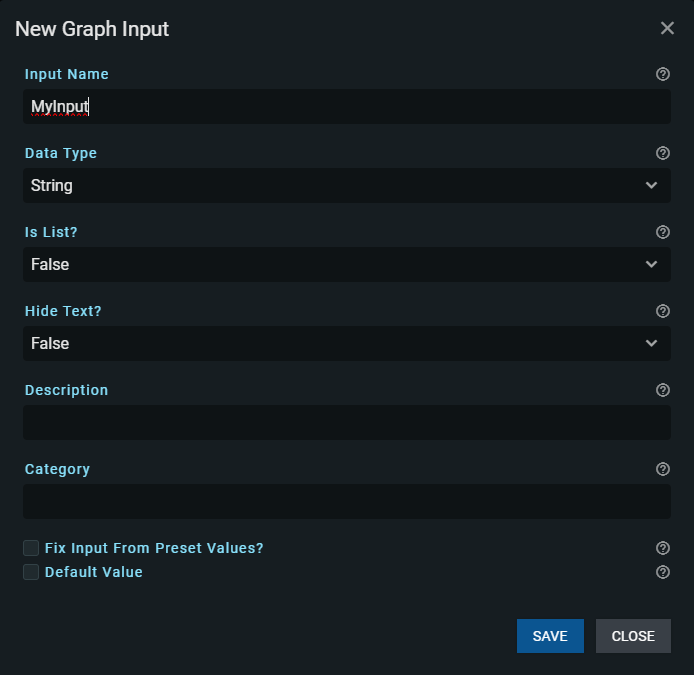
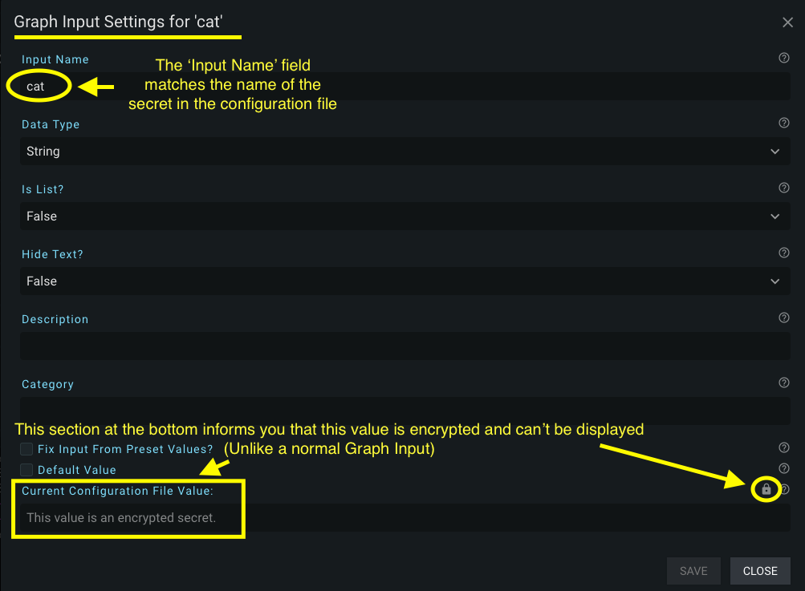

# Sidebar Panel

The sidebar panel is a collection of features available to you. Each feature has an icon to help you remember what each one is for. Clicking on an icon will "pop-outward" (right) the panel for that individual feature. You can also hover each icon for a text description of each feature before clicking them.


The following sections will explain each sidebar feature individually (as they appear in sequence from the top of the bar to the bottom).

## Files Panel

The Files Panel provides a list of all files and folders (directories) in the root directory where the Graphex server is running (see the 'Common Arguments' [for running Graphex](../setup/running.md) to learn more about the root argument). The Files Panel also contains buttons and context menu options to manage Graphex files, folders/directories, and refresh the current view of the file system.

The Files Panel can be opened and closed by left-clicking on the 'Folder' icon at the very top of the sidebar:


When opened, the icon's background color will change to a grey to let you know which Sidebar Panel is currently opened. A scrollbar will appear if the information displayed in the panel is longer than the vertical length of the panel. The scrollbar can be moved with the middle mouse scroll-wheel while hovering the panel.

$warning$ Files will not appear in the panel if the server doesn't have access rights to read the entire directory.

All sidebar panels are resizable by dragging the 'handle' icon on right side of the panel:


As an example of a populated Files Panel:


Folder names have left-clickable carets ('>') next to them to indicate that they are both (1) a folder and (2) clickable to expand. Left-clicking a folder name (or the caret) will reveal any files (and folders) located underneath that folder:



Notice that in the above two images there are two different icons for different file types (based on the extension of the file). The blue 'GX' icon indicates that the file extension is '.gx' (a valid Graphex file) and can be opened and edited through the Graphex UI Editor Panel. Files that have any other extension will appear with a range applicable (but different) icons to distinguish them from each other. Files that have image extensions (jpg, png) can be opened by GraphEx in a new tab in your browser. All other files will open [the minimal text editor provided by GraphEx.](textEditor.md).

Left-clicking a valid graph file will open it the Editor Panel. Right-clicking files and folders will open a context menu with various operations you can perform on the target. Some examples are: open the file, run the file in the UI, duplicate the file on the file system, renaming files and folders, deleting files and empty folders, creating subdirectories, and moving files between folders.

Moving files and folders can also be accomplished by holding down left-click while hovering your target and then dragging the target to the desired location.

### Files Panel Buttons

There are three buttons on the Files Panel:


They can all be hovered to get the name of their function.

The leftmost, 'plus sign' ('+') button opens a dialog to let you create a new graph file on the filesystem. This new file is also opened in the Editor Panel when creation is complete.

The middle, 'folder with plus sign in it' button opens a dialog to let you create a new folder on the filesystem.

The rightmost, 'circular arrow' button will refresh Graphex's view of the file system. It is necessary to press this refresh button if you make changes to the file system outside of Graphex.

## Nodes Panel

The (Add) Nodes Panel is where all the available nodes that you can use in your graph are stored. We also sometimes call it the "Nodes Store". Nodes can be searched for via name or description using the search bar at the top of the panel. Underneath, the nodes are broken down into categories to make them easier to find. Finally, the nodes corresponding to the selected category are displayed at the bottom of the panel.


### Node Panel Searchbar

The searchbar at the top of the panel can be used to quickly find nodes matching your query. The searchbar ignores the category of the node when searching. The searchbar is not case sensitive (lowercase/uppercase doesn't matter). It will search both node names and descriptions. Nodes will appear in order of revelance to your search. Node names and the sequence of terms you search on are given precedence over node descriptions.

### Navigating Node Panel Categories

Hovering a category will change its background color to a grey to indicate that you are hovering it. Left-click a category to decend down into the selected category. The panel will dynamically update the subcategories and nodes available.

For example, I clicked on the 'Math' category. You can see a path to the current category displayed underneath the word 'Categories'. New subcategories for the 'Math' category are displayed. Nodes that don't have a subcategory are then displayed underneath the word 'Nodes':


You can click anywhere in the path (below the word Categories) to navigate back to that point. As mentioned in the [Files Panel section](#files-panel), you can move the scrollbar up and down on the current category via the middle (scroll-wheel) mouse button.

Nodes found via categories are displayed in alphabetical order.

### Nodes in the Sidebar

Lets take a look at a node in the sidebar. I'm still under the 'Math' category. The first node displayed is 'Absolute Value of Number':


The title of the node is displayed in white with the larger font size. The description of the node is directly underneath the title in a italized, grey color. The description on the node in the Sidebar Panel is the same one you will receive when hovering the 'help icon' on a node in the Editor Panel.

Hovering a node in the Sidebar Panel will give you instructions on how to move the node into the Editor Panel:


Double-clicking will place the node in the center of the Editor Panel. Left-clicking and dragging the node will let you place the node wherever you wish in the Editor Panel.

When the node appears in the Editor Panel, it will show that it has errors until you resolve all issues with the sockets. If you haven't read it already, [the section on the Editor Panel](editor.md) describes node interactions in further detail.

### Primitive Data Nodes

Primitive data nodes are categorized under the 'Data' category in the Node Panel. You can also search for them by searching 'New ___'. For example, searching for 'new string' would give you a String datatype as the top search result. You could then drag it into the editor and fill it in with whatever string you wanted to use. Remember to connect the circular, green output socket to an 'action' node in order for it to consume and use your String data.


Additionally, you can quickly create a data nodes by right-clicking on an empty part of the editor and selecting the node you want to add from the 'Add Primitive Data' dropdown:


#### Favoriting a Node

The star in the upper right-hand corner of a node in the Sidebar Panel gives you the opportunity to 'favorite' a node. This is recommended for nodes that you tend to use frequently. Clicking the star will change it to a gold color. This gold color star informs you that the node is one of your favorites. Favorite nodes are saved to your browser storage and will persist each time you open the UI in your browser (from the same server). Other people using the same server will likewise see their own favorite nodes.

Favorite nodes can be retrieved from the next panel in the Sidebar, the 'Favorite Nodes' panel. I'm going to 'favorite' the 'Absolute Value of Number' node for demonstration in the next section.

## Favorite Nodes Panel

The Favorite Nodes Panel displays all the nodes you have 'favorited' from the normal Nodes Panel. It is identifiable by a star icon on the sidebar.


In the previous section, I clicked the grey star on the 'Absolute Value of Number' node from inside the Nodes Panel. That node now appears here in the Favorites Panel. Functionally, this sidebar is identical to the Nodes Panel. You can search and add nodes in the same way.

Categories are not displayed in the Favorite Nodes panel. The searchbar will only search through your list of favorite nodes.

You can remove nodes from the Favorite Nodes Panel by clicking the gold star in the upper right-hand corner. This can be done either from the Favorite Nodes Panel or the normal Nodes Panel.

## Search Panel

The Search Panel is used to find nodes in your (currently opened) graph or globally search for text located in files in the root GraphEx directory. Its primary function is to help you find nodes and text quickly. By default, the panel shows you a list of all the nodes in your graph. This panel is identifiable by a magnifying glass icon on the sidebar.


### Searching Locally

Hovering the nodes in the Search Panel will highlight them for you in the Editor Panel. Left-clicking a node will both select it for you and move your Editor Panel camera to focus on the node. Other nodes will be deselected when clicking a node in the Search Panel.

The search bar at the top of the panel can be used to filter through the nodes in your current graph. In addition to filtering on the name and description of the node, it can also be used to find fields matching values and the names of sockets contained inside the nodes. Try searching 'hello world' in the default graph and the panel will filter out all the nodes in your graph except for the 'Log (Print)' action node containing 'Hello World!' as its input.

### Searching Globally

Sometimes searching only your current graph isn't enough to find what you are looking for in a larger system of interconnected graphs and subgraphs. You can left-click on the "Global Search" checkbox to enable a search across the filesystem (as seen by GraphEx). This "global search" is slightly different from the "local" one in that it searches for text contained in files instead of data attached to nodes.


As shown in the above image, you can gain access to a number of filters by left-clicking on the "Show Filter Options" button (e.g. ellipsis of three dots):


Applying various filters can help you narrow down your search:
- Stop on Match: Enabled by default, this option stops searching through a file when it finds a match. Disabling this checkbox increases search time but will show multiple matches in a single file.
- Case Sensitive: Enabling this checkbox enforces the case (upper or lower) of the text you are searching for. By default, all searches in GraphEx are non-sensitive to casing.
- Match Filenames: Enabling this checkbox will include filenames in the search results (e.g. readme.txt would show up in the results if "readme" was searched while this option was enabled).
- GX Node Deep Search: Enabling this checkbox will mutate the search into one that only searches for results in GX files and offers you more detail to match on. Enabling this option is similar to running a "local" search of the current graph you have open (i.e. with the Global Search checkbox disabled). To be precise, enabling this option will allow you to match on node descriptions and output socket names despite the text for them being located in the plugin files themselves (and thus NOT in the directory you are serving via GraphEx).
- Include File Extensions: You can provide a comma separated list of file extensions to this searchbar. Only files with the requested extensions will searched for matches.
- Exclude File Extensions: You can provide a comma separated list of file extensions to this searchbar. Extensions provided in this search bar will not be searched for matches.

Regardless of your filtering options, GraphEx will stop searching globally for results if it finds more than 1000 matches. Notice that the text on how many matches were found will change if you break this threshold:


If you see this message, it is very likely that you aren't going to find what you are looking for. It is recommended you either add more characters to your search query in the search bar and/or adjust your filters to hone in on what you are looking for.

Global search causes a heavier resource toll on your system. In order to help mitigate some the impact of the search, there is a very slight delay between when you type a character into the search bar and when the search is attempted. This allows you to type out a longer string of characters before the search is started. While searching GraphEx will display a loading/searching animation.

$note$ Unlike local search, which can search a graph even without a server connection, the global search REQUIRES a server connection at all times. Should you try to search a graph while the server is disconnected: you will receive a red error message in the sidebar panel asking you to check your connection.

$note$ You need to re-initiate a global search after server connection issues. You can do this by adding or removing characters from your search or clicking the various filter options off/on. Should the searching/loading indicator run an unexpectedly long amount of time, it is likely that a connection issue occured.

### Reference Search

Checking the 'Find References To This Graph' checkbox added in GraphEx v1.10.0 will show you all 'Execute Graph' nodes that execute the current graph you have open in the editor. This functionality lets you find the 'parent' of the current graph you are viewing (if the current graph is used as a subgraph). This functionality searches files in the provided 'root' directory given to GraphEx when you served the server (e.g. files visible in the Files Sidebar Panel). This functionality will only find 'Execute Graph' nodes that have the full path provided in the input field of the 'Execute Graph' node.

Search matches can be left-clicked to open the corresponding parent graph and focus the camera on the 'Execute Graph' node.

## Configure Graph I/O Panel

The Graph Input/Output (I/O) Panel allows you to configure data inputs to and outputs from a graph. These are inputs and outputs to the _current graph itself_. Just like action nodes can have both input and output data sockets: graphs themselves can have inputs and outputs. These input and outputs are the closest thing Graphex has to Command Line Arguments (CLI args) in traditional programming.

### Usage of Inputs and Outputs to a Graph

The primary use of inputs to a graph are for command line arguments. Often, you want to be able to provide user input data to your graph/program. The inputs you create in this panel will appear as command line arguments that you can provide when running your graph/program from the command line interface (CLI). Additionally, when you run your graph from the UI: you will get an opportunity to fill in any of these inputs before running/executing the graph. You will learn more about running your graph from the UI when [reading about the Terminal Panel](terminal.md) in a later section.

The secondary use of both inputs and outputs is to 'nest' graphs inside each other. This is accomplished by using a special node known as the 'Execute Graph' node. This special node treats another graph file as if it was a singular action node. This would be equivalent to writing your own function in most other programming languages (and then calling it later). You can learn more about the 'Execute Graph' node in the [its standalone feature document](../advanced/executeGraph.md).

### Tour of the Configure Graph Panel

A fresh 'Configure Graph' (Graph I/O) Panel looks like this:


The 'plus' ('+') sign buttons in the panel let you create either an input or an output. As you add them to the panel, they will start off in the order you insert them.

After you create a few inputs and outputs, the panel will start to look like this:


The color of each data type is displayed as a vertical bar next to the name of each input or output.

Data in the sidebar is sorted by categories, which is determined by the *'category'* field for new inputs. Leaving the *'category'* blank will put the input in the *'Default'* category. Input categories can be open and collapsed by clicking on them directly. It is also possible to open/collapse all categories via the toggles next to 'Graph Inputs'.


If you have many inputs/outputs, you can rearrange them by left-clicking, holding down the mouse button, and dragging them into the sequence you want them in. This sequence will be retained when running the graph through the UI.

If any of your graph inputs (or outputs) are 'unused' (meaning there are no nodes in the graph currently utilizing the input/output) a yellow 'explanation mark' ('!') will appear next to the unused input or output in the sidebar. Additionally, the icon on the sidebar will change to a yellow color to inform you of this warning:


### Creating a Graph Input

Create a graph input by left-clicking the plus ('+') sign button next to the words 'Graph Inputs'. A popup modal will appear with different fields for you to fill in:



Help icons appear at the right end of each field or dropdown to guide and give additional information.

#### Input Name

This field is the name that the input (and argument) will have. Input Name's aren't allowed to contain spaces. They also aren't allowed to have a name that another input already has.

On the command line, you will provide a graph input by the following syntax: inputName=inputValue

For example:
```
python3 -m graphex run --file name_of_graph.gx MyInput=some_value
```

If you need to provide a sequence of text with spaces (i.e. a string with spaces), you can do so by placing quotation marks around your text:
```
python3 -m graphex run -f Untitled-1.gx MyInput="Text with spaces"
```

#### Data Type

The Data Type field is a dropdown that will populate with all the available data types. Left-click on the default data type (_String_) and then left-click the data type you desired as an input. In vanilla graphex, this is just the default primitive values of _String_, _Boolean_, and _Number_. Data types added by plugins will also appear here.

$warning$ Data types created by plugins cannot be used as CLI arguments. If you add a custom data type as a graph input: the graph will not be runnable/executable by the UI. Only primitive data types make sense from the command line. When adding non-primitive (plugin) data types as an input, it is inferred that you will use them through the 'Execute Graph' node (as a child/subgraph of another graph).

#### Is List?

Another concept we have not discussed is lists. In Graphex, lists are a data _structure_ that contain many values of a single type. For example, you could have a list of strings, or a list of booleans, but not a list of both strings and booleans.

You can think of lists as a container of values. The values are ordered in the order you insert them to the list (the first value is first, second is second, etc.). There are specialized nodes for lists as described in [the advanced Graphex features document that pertains to specialized nodes](../advanced/nodes.md).

This option in the modal simply asks if this input should be a list or not.

Lists can be provided on the command line by separating each list value with a space or a comma.

Some examples:
```
python3 -m graphex run --file name_of_graph.gx SomeList=value1 value2 value3 SomeOtherList=otherValue1 etc
python3 -m graphex run --file name_of_graph.gx SomeList=value1, value2, value3
python3 -m graphex run --file name_of_graph.gx SomeList=value1,value2,value3
```

All of the examples above will give the following list to Graphex: ["value1", "value2", "value3"]. If you want to include the comma character (,) in your list, you will have to escape it with a double backslash:
```
python3 -m graphex run --file name_of_graph.gx SomeList=value1\\, value2\\, value3
python3 -m graphex run --file name_of_graph.gx SomeList=value1\\,value2\\,value3
```

If you escape the comma, GraphEx will *not* count the comma as a separator in your list. Thus the first example will create the list: ["value1,", "value2,", "value3,"] and the second example will create a list of a *a single item:* ["value1,value2,value3"].

When providing lists of strings, you do not have to "quote" the strings. The graph input was already previously defined in the UI to have a datatype of "String List". That being said, if you provide quotes of either type ("like this" or 'this'): GraphEx will remove them from the input. Thus MyInputList="abc" "def" would become simply: abc def. If you want to include quotation marks, escape them with a single backslash:
```
# evaluates to ["'value1'", "'value2'"]
python3 -m graphex run --file name_of_graph.gx SomeListWithMarks=\'value1\' \'value2\'
```

#### Hide Text?

This dropdown will only appear for _String_ datatypes.

When this dropdown is set to 'True': any characters that appear in the 'Run Graph' menu/modal will be obfuscated as if they were passwords. This is useful for passwords and secrets that you don't want shared when running graphs from the UI.

**Developer Note:** The input fields that are hidden are implemented using the HTML input field's type="password" option.

#### Description

Here you can type a description of what the graph input is for or what it expects. The description will appear in the help menu on the command line (-h) and also in the 'help icon' when running the graph from the UI.

This field is optional.

#### Category

This field is also optional. You can provide a category in which to group graph inputs under. This is useful when running the graph from the UI, as each group will receive its own tab in the 'Run Graph' modal.

If at least one category is specified in all the graph inputs, and you leave this field blank in any others: the category will become 'Default' for the graph inputs that don't have a category.

The categories will appear sequentially in the 'Run Graph' modal based on the sequence that they appear in the sidebar panel. Move the graph inputs with categories that you want to appear first to the top of the sidebar.

#### Fix Input From Preset Values?

The 'Fix Input From Preset Values?' toggle is available for data types 'Strings' and 'Numbers'. This gives the option for the input to be selected from a preset list of choices. When 'Fix Input From Preset Values?' is toggled on the options can be filled out as seen below.

$warning$ These options must be case insensitive unique. To give an example, options ['APPLE' and 'apple'] would not be valid since they would match if both upper case. The UI will warn you if this is the case.


When running the graph with an enum input, the value is selected from the options set.


Setting inputs via the CLI does not change if 'Fix Input From Preset Values?' is set to true. The help menu (-h) will display the list of acceptable values. Within the String the input values only have to match in letter only, not case. For example, if 'withOptions' string graph input has enum options 'yes' and 'no',

```
python3 -m graphex run --file name_of_graph.gx withOptions=YES
```

and 

```
python3 -m graphex run --file name_of_graph.gx withOptions=Yes
```

would both work.

#### Default Value

This option will only appear for primitive data types (_String_, _Boolean_, and _Number_). See the above warning on the 'Data Type' option for more information.

When you run a graph that contains graph inputs: all inputs must be provided to run the graph. If all inputs are not provided, Graphex will believe there is an error and fail to run your graph.

You can override this by checking the 'Default Value' checkbox in this modal. This will create a blank field that you can fill in optionally. This default value will be provided if nothing is given for this input when running a graph.

The precedence (order in which a value is chosen) of Graph Inputs is explained in more detail in [the file on configuration files](../advanced/config.md).

#### Values Set Via Configuration File

If the name of your graph input (as provided by the 'Input Name' textbox) matches a name provided in your configuration file: GraphEx will display the value currently being set for this graph input from the configuration file. This value will be shown at the bottom of the popup modal and is not directly editable by you via the UI (by design). This value will appear in a 'greyed-out' textbox to indicate to you that it is not a field you should edit from the UI. Should the input also have 'Hide Text?' enabled, you will see a toggleable 'eyeball' icon as well.

For example, take a look at this graph input called 'EsxiUsername' that had a matching configuration file value:


In the image above, the UI is telling you that the value for this graph input will automatically be set to 'root' when you go to run the graph from either the UI or the command line. Hovering the 'help' icon (question mark) will also inform you that this configuration file value overwrites any value you provide for 'Default Value' (explained in the previous section) in the UI. For more information on the precedence of graph input values, read [the file on configuration files](../advanced/config.md).

Since configuration files can only provide _primitive data_, this configuration file information will never appear for any type of graph input with an object as a value.

This pane will also autodetect if you graph input matches the name of secret. The display will look slightly different:



You can learn more about secrets in [the dedicated document on them](../advanced/secrets.md).

### Importing Graph Inputs From a Configuration File

You can use the 'Import' button to create Graph Inputs that match the names of Inputs defined in your configuration file.


Left-clicking the button with your mouse will open a modal that will allow you to select Graph Input and Secret names that you wish to import in the current graph:


This modal will appear empty if you don't have a configuration file loaded or if the configuration file doesn't contain any Graph Inputs.

Left-click the Graph Inputs in the left-hand column that you wish to import and then left-click the 'singular' left arrow to move the imports into the right-hand column. When you have finished moving over the inputs you wish to import, click on the 'Import' button to add them to the Sidebar Panel of the current graph.


The 'singular' right arrow can be used to remove inputs that were moved into the right-hand column. The 'double' left arrow will add all entries in the configuration file to the right-hand import (allowing for a bulk import of all inputs). Likewise, the 'double' right arrow will remove all selected entries from the right-hand column.

The import modal is only able to determine a few things about Graph Inputs imported from the configuration file: the name of the input, the datatype of the input, whether the input is a list or not, and whether the input is a secret or not. You will be able to see the value of Graph Inputs in the configuration file by viewing each entry in the Sidebar Panel after import (as usual). Secrets are a bit more restrictive when it comes to importing them. Since the value of the secret is encrypted, the import modal will always make the datatype of the Graph Input the *String* datatype. All imports are automatically added to the 'Default' category. Make sure to go through and manually edit the Graph Inputs that you wish to modify.

Graph Inputs must have unique names. If you try to import an input that already exists in the Sidebar Panel, GraphEx will create another popup modal warning you that this has occured:


Most of the time, you will likely want to click the **'SKIP'** button. This is because Graph Inputs that were manually configured contain more information/attributes than the 'boilerplate' input created by the import modal. You can also choose to DELETE the existing input and replace it with the boilerplate template.

### Creating a Graph Output

The Graph Output modal is almost identical to the input one. There are fewer fields to fill in. Remember that outputs only apply when using the 'Execute Graph' node and will have no effect on the 'main'/'top level'/'parent' graph.

Create a graph output by left-clicking the plus ('+') sign button next to the words 'Graph Outputs'. A popup modal will appear with different fields for you to fill in:


Help icons appear at the right end of each field or dropdown to guide and give additional information.

#### Output Name

This is the name that will appear next to the data socket that outputs this value from the 'Execute Graph' node. Output Name's aren't allowed to contain spaces. They also aren't allowed to have a name that another output already has.

#### Data Type (Output)

The data type that will be output.

#### Is List? (Output)

If you aren't sure what a list is, read the explanation for ['Is List?' under 'Creating a Graph Input'](#is-list). This field is the same, set the dropdown to 'True' if you intend for this value to be output as a list.

#### Description (Output)

The (optional) description of the data being output. If provided, this will appear as the information provided when hovering the output socket on the 'Execute Graph' node.

### Graph Description

The last part of the Configure Graph Sidebar Panel is the 'Graph Description' textbox. This box is at the bottom of the panel. You can describe the purpose/functionality of your graph here. When other users execute your graph as a 'subgraph' (i.e. as a function in traditional programming) using the 'Execute Graph' node, the user will be able to read your custom description in the help icon on the 'Execute Graph' node.


## Variables Panel

The Variables Panel keeps track of all the local variables set in your graph. It also keeps tracks of nodes that explicitly get a variable that was previously set.

In newer versions of GraphEx, the variables icon appears as the letters 'ABC':


The older version of the icon appears as a 'selected box' and can be seen in the following docs. When you first open the variables panel on a fresh graph, there will be no variables in the graph:


As the sidebar panel detects variables in use in your graph, it will update to show the names of the variables found:


### What is a Variable?

Variables in programming aren't all that different from variables in Algebra (see [this video from Khan Academy](https://www.khanacademy.org/math/algebra/x2f8bb11595b61c86:foundation-algebra/x2f8bb11595b61c86:intro-variables/v/what-is-a-variable) if you need more information on variables in Mathematics). They are simply placeholders that represent a previously defined value.

Variables are commonly used in programming to both store and maintain values. A common example might be counting the number of people in a room. You originally count four people and store that to a variable called 'Number of People'. Later, if someone leaves or joins the room, you can update the value for 'Number of People' by adding or subtracting numbers called literals (as in _literally_ the value '1'). Numbers not stored in some way (e.g. in variables) that are 'hard-coded' into a program are usually called 'literals'.

### Adding a Variable from the Panel

As mentioned above, the Variable's Panel keeps track of **all** variables set in the graph. You create variables using specialized nodes and these nodes can be added either from [the Nodes Panel](#nodes-panel) or from this panel.

To create a variable from this panel, press 'plus' ('+') sign button in the top right of the panel. A dropdown will appear with a list of different nodes that you can choose to create variables from. Left-click with your mouse on the node that you would like to add to the center of the Editor Panel:


You will see a couple different combinations of nodes available in this dropdown:
- Nodes that set variables for specific primitive datatypes (e.g. String, Number, or Boolean)
- Nodes that set variables for *any* type of data (i.e. Dynamic)
- Nodes that set variables exclusively for lists (and will not set non-list data)

Earlier on this page we described [getting primitive datatype nodes from the Nodes Panel.](#primitive-data-nodes) You can use any of the provided primitive datatype 'Set Variable (*datatype name*)' nodes and type in a String, Number, or Boolean value and have it saved to a variable immediately.

For example, here is a freshly created "Set Variable (String)" node:


You could then immediately type in some kind of string data you want to save (or use the three dots next to the input to choose a different type of input to save), such as a street address, to the 'String to Save' input. Type in the name you want to give the variable in the 'Variable Name' input. As you populate the 'Variable Name' input with text, the sidebar panel will also update to recongize this is a location where the variable is being set in the graph:


Using your mouse and left-clicking on the name of the variable in the sidebar panel will show you that a 'SET Node' is creating this particular variable and that its value is set to '123 some street':


Both primitive and non-primitive data can be saved to a variable using the generic 'Set Variable' node. Note that this particular node will appear 'greyed out' until you connect a value that you want to save to it. The node will then dynamically generate into the type of data you want to save.

For example, a fresh 'Set Variable' node will look like this:


Notice that you can't type any primitive data into an input box like you could with the 'primitive' datatype variable setter nodes. You have to provide a data connection (or use a graph input from the 'three dot' menu) in order for the node to figure out what kind of data to save. For example, we could add a "New Number" node to the editor using the Nodes Panel and then connect it to the 'Value to Save' input socket to get the node to properly update to store the "Number" datatype:


The 'Set List Variable ...' nodes are the same as the others described in this section except that you use them only for lists of data.

More information about these specialized variable nodes is provided in [the advanced Graphex features document that pertains to specialized nodes](../advanced/nodes.md).

### A Populated Variables Panel

After one or more variables is detected in the graph, the panel will display each variable that is either 'Set' (e.g. created or overwritten) or retrieved (also called 'GET' in programming) in the graph you are currently viewing. To get more information about where this is happening for a particular variable, you left-click the name of the variable to create a dropdown of all the references to the variable:


Each top-level variable name appears in the same color as its datatype. For example, a string variable will appear in green text in the variables panel (see above image). References to the variable will appear in the 'bordered' boxes below the name of the variable. The color of the border matches the node in which is referencing it (not the datatype of the variable):


You can left-click on sub-items to move the camera in the editor panel to where the variable reference was detected. When a sub-item reference is hovered, it will also highlight the source in the editor panel:


There are two boxes in each sub-item reference:
- A left-hand box that displays the purpose of the node reference to the variable (e.g. GET Node, SET Node, GET via, SET via)
- A right-hand box that displays various status information about that variable reference

#### The Left-Hand Box (Purpose/Origin)

The left-hand box will say 'SET Node' if the reference is due to a 'Set Variable...' node (of any kind) in the graph. Likewise, it will say 'GET Node' if the sub-item is a reference to a 'Get Variable' node in the graph. You can infer that anytime the left-hand box has the word 'Node' in it: it is simply a node for creating, setting, or retrieving the value of the variable.

The left-hand box will say 'GET via: *the name of the node that is getting the variable*' if a node that isn't specific to variables is using your variable. For example, you can select a variable as an input to a socket by left-clicking the 'three dots' menu next to the input socket and hovering the 'Variable' option in the dropdown. If you then click on the name of a previously set variable (of the proper datatype), the Variable sidebar panel will describe this retrieval reference as 'GET via ...':


Notice in the image above that the node also tells you that its getting is input from a variable called 'My String Var'. 

Finally, the left-hand box will say 'SET via: *the name of the node that is setting the variable*' if a **non-variable** node is setting the value of the variable. Newer versions of GraphEx allow individual output sockets to directly save their output to a variable if the developer determined that the output is nearly always used directly as a variable. At the time of this writing, you will only see these output sockets in plugins. For example, the 'Open SSH Connection' node added by one of GraphEx's plugins will leverage this new feature:


Notice that the name of the variable becomes the name of the output socket that has the checkbox 'enabled' (In the image above: 'SSH Connection'). Just like setting a variable anywhere else in the graph: if a variable with the name 'SSH Connection' already existed it will be overwritten by this 'SET'. You can 'uncheck' (disable) the checkbox to prevent the node from saving the output to a variable. If you would like to name the variable something different, you can 'uncheck' the checkbox then right-click the variable and select 'Save Value to Variable'. Then manually type in the different name you would like for the variable. This right-click option is available in the dropdown menu for every output socket on every node in GraphEx:


#### The Right-Hand Box (Status Information)

The right-hand box provides information about the *socket* on the node in which is relevant to the value of the variable being stored or retrieved. Generally the text color will change to match the severity of the status information. The color yellow is reserved for a warning (possible problem) and red for a detected error. The color green is used to indicate a proper connection. The colors white and grey can also be used to display actual variable values or other input sources to the variable (explained more below).

If the left-hand box shows 'GET Node', then the only available options for the right-hand box are:
- Connected (in green text)
- NOT CONNECTED (in red text)

These status messages correspond to the output socket on the 'Get Variable' node. Either it is connected to an input or it isn't:


If the left-hand box shows 'SET Node', then there are many more status messages that can appear:
- A connection message such as 'Connected' (in green text) or 'NOT CONNECTED' (in red text)
    - These connection messages are for the *input socket* on the setter in this case, such as: 'String to Save' or 'Value to Save'
- A warning that the data being set is empty or missing, such as: 'EMPTY STRING', 'EMPTY LIST', etc. (in yellow text)
- The literal value typed into the input field that the 'Set Variable' node is storing (e.g. '123 some street' in the 'String to Save' input) (in white text)
    - List variables will show this information separated by comma (',') characters
- The name of some other variable or graph input that was selected from the 'three dots' menu to be stored by this variable (in grey text)

If the left-hand box shows 'GET via: ...' then the right-hand box will always display the name of the input socket using the variable in green text:


Likewise, if the left-hand box shows 'SET via: ...' then the right-hand box will always display 'Checkbox Enabled' (as shown in the image in the previous section). If the checkbox is disabled, then the sub-item reference will not appear in the sidebar at all.

### Error Borders

In addition to the status information displayed in the 'right-hand boxes' of the variable name sub-items: a red border will appear around the names of variables that have detected various kinds of errors with the variables in your graph. Hover the name of the variable with your mouse to get a tooltip description of what error was detected. The following errors are currently detected and indicated by this red border:
- The graph has a 'GET' reference but doesn't contain any kind of 'SET' reference (i.e. a variable is trying to be retrieved but was not previously stored anywhere).
- The variable is using a dynamic 'Set Variable' node but no value was provided to the variable to save. The sidebar is then unable to determine which datatype the variable is supposed to be
- The variable has a name that has already been used for a different datatype in the graph. While this is technically okay most of the time, the 'Get Variable' node will not know which datatype to retrieve and will default to the first variable ever created with that name.

Here is an example of a graph that has a 'GET' variable node but has no node that is 'setting' its value:


### Creating More Variable References

If you have at least one variable already referenced in your graph: you will have access to a right-click context menu on all the individual names of the variables. This context menu lets you quickly add new 'SET' and 'GET' nodes with the name of the variable already filled into them.

For example, a non-list variable has the following options:


Likewise, a list variable has its own relevant options:


More information about these specialized variable nodes is provided in [the advanced Graphex features document that pertains to specialized nodes](../advanced/nodes.md).

### Folding and Unfolding Variable Trees

In the top right corner of the Variables Panel, there are three buttons. We have already discussed the 'Add New Variable' button ('+').

The other two buttons 'fold' (hide/contract) and 'unfold' (show/expand) all the sub-items for every variable in the graph:


The first button (farthest left) is the fold button and the next button to the right is the unfold button.

This is useful if you want to see the status of every variable in the graph at a glance.

## Inventory Panel

The Inventory Panel can be used to keep track of a 'static' set of primitive data of your choosing. It can also be configured to create specific nodes at certain levels of the hierarchy. A populated inventory panel will look similar to below when the icon is first clicked:


The top 'button bar' on this panel contains options to expand and fold-up the entire inventory tree. The dropdown at the top of the panel allows you to select any of the inventory files provided to GraphEx when the server was served:


Notice that the dropdown shows both the directory and the name of the file in which the inventory is being populated from. Each individual yml file can be selected one at a time from the dropdown. The creation and structure of these files is explained in the next sections of this document.

Entries with borders/boxes around them can be dragged into the graph in order to create a node. Grey borders indicate that a node was specified in the inventory file to be created when this entry is pulled into the graph:


Entries with right-arrow (carets) '>' next to them can be expanded via left-clicking with your mouse:


Notice that the only sub-entry in the above image that can be dragged into the graph is the 'Tags' sub-entry. This particular entry happens to be a list *all* String data. GraphEx will automatically create these lists for you if you create lists of one data type in your inventory YML file.

The other sub-entries in the example above are not directly translated into nodes in the graph. You must continue to left-click them to dive down deeper into the inventory hierarchy structure. For example, left-clicking 'FQDN' will reveal a String data field corresponding to the 'FQDN' for the 'SomeVM' entry (a router in this example). You can then drag this primitive data into the graph to create an 'inventory node':


These 'inventory' nodes can only be created from this Inventory sidebar panel. Since the data contained in them is 'static' (unchangeable and set in the inventory YML file), you can see the value of data in the input box directly in the graph. This input box is not editable from inside GraphEx itself. The value both shown and stored in this node will automatically update when changes are made to the corresponding value in the inventory YML file. This means you should always use these inventory nodes (instead of something like 'New String') when refering to static data from your inventory (as it will automatically update when changes are made to the YML files).

Also notice that instead of the 'name' of the node you have a 'hiearchy path' to retrieve the node from the inventory. You can very clearly see that this node is from the file 'Cisco.yml' located in the directory 'Hosts' and has the path 'SomeVM -> FQDN' in the YML file. Additionally, the 'inventory' icon appears in the upper right hand corner of the node with the same icon used for the sidebar panel (a 'server stack' icon).


### Creating an Inventory File

Inventory files are simply YAML files. Each entry is a dictionary and should be provided as a list. Sub-entries are then key/value pairs in the dictionary and the 'value' parts of each key can either be primitive data, lists, or dictionaries. All hiearchies in the inventory file must end in some kind of primitive data.

Here is an example of an inventory file structure (with many sub-entries removed to make it more digestable):
```yml
---
- Name: SomeVM
  Type: Virtual Machine
  Tags:
  - Static
  - Firewall
  OperatingSystem: PanOS
  Networks:
  - Name: NetworkName
    IP: 1.2.3.4
    Provisioning: yes
  Node:
    Name: Get SomeVM

- Name: AnotherVM
  Type: Virtual Machine
  Tags:
  - Static
  - Firewall
  OperatingSystem: PanOS
  Networks:
  - Name: Network2Name
    IP: 2.3.4.5
    Provisioning: yes
  - Name: Network3Name
  Node:
    Name: Get AnotherVM
  
# This makes the 'get all' option available in the sidebar panel
- Name: Get All PanOS VMs
  Node:
    Name: Get All PanOS VMs

```

The 'Name' key is required for each entry. Sub-dictionaries must also have the 'Name' key at each subsequent nested dictionary (for displaying in the sidebar panel). The key '**Node**' is a restricted keyword that can only be used in GraphEx configuration files for designating a specific node should be retrieved when this entry is dragged into the graph. This 'Node' key is what ulimately designates the 'grey borders' described in the previous section. You can see in the above example YML that all entries have a 'Node' key and then describe the name of the node that should be retrieved with the 'Name' key followed by the name of the node as the value. The node names shown in the example above are created by a plugin and don't exist in the base (vanilla) GraphEx.

Even though the 'Node' key is restricted in use to the case mentioned in the previous paragraph, it is **NOT REQUIRED** for every entry. It can be used as desired to create more complex data than primitive values alone. GraphEx will automatically create the nodes for the primitive data for you (based on the type of data inferred from the YML file). As mentioned previously, lists of a singular type will also be autogenerated by GraphEx for you.

Lastly, I would like to point out that you can create inventory entries that represent all other entries in a particular file. In the above example this is the 'Get All PanOS VMs' entry. It doesn't actually hold any static information about an inventory item, but it does specify a node that lets you get all 'PanOS VM' objects. You can combine this idea with nodes created by plugins (or base/vanilla GraphEx nodes) to perform similar operations specific to your use case.

### Loading an Inventory File into GraphEx

Inventory files are provided to GraphEx via the path to the directory containing all inventory files you want to use. There are two ways to provide this to GraphEx:
- By providing the path to the argument when running or serving GraphEx: -inv /path/to/directory or --inventory_path /path/to/directory
- By adding the 'inventory_path' key to your GraphEx configuration file and setting it to the path to the file

$warning$ Once inventory file nodes are used inside a GraphEx graph they must **ALWAYS** be provided to run that particular graph (regardlesss of how it is ran).


## Source Control Panel

The Source Control Panel gives you the ability to manage your git repositories.


This panel is separated into three tabs: the [Source Control tab](source_control_tabs/sourceControlTab.md), the [Local Branches tab](source_control_tabs/localBranchesTab.md), and the [Remote Branches tab](source_control_tabs/remoteBranchesTab.md)


## Errors and Warnings Panel

The Errors (and Warnings) Panel gives you an overview of all the errors (and warnings) identified in your current graph. The icon for the Errors Panel is an octagon with an explanation point in the center of it. When a fresh (default) graph is created, there will be no errors in the panel view (and it will appear empty).
 


As an example, if you disconnect the link sockets in the graph: the Errors Panel will display every single socket that has an error. The Errors Panel icon also has a unique feature when compared against the other icons in the sidebar: it will change to a red color when errors are detected in the graph. Likewise, the icon will be the color yellow if any warnings appear in the graph.


These errors must be resolved before the UI will let you run/execute the current graph.

Each error or warning in the sidebar will give you the following information in sequence:
- The name of the node in the Editor Panel that has an error (in white text)
- The part of the node that has a problem (in grey text)
- The error/warning message itself (in red/yellow text)

The nodes themselves in the Errors Panel work the exact same way the nodes in the Search Panel work. Hover the erroring nodes in the sidebar to have them highlighted in the Editor Panel. Left-click an erroring node in the sidebar panel to both select it in the Editor Panel and center the Editor Panel camera on the node.

## Terminal Icon

At the very bottom of the sidebar there is an icon that allows you to open and close the web terminal:


Clicking this icon opens and closes the Terminal Panel. More information on the Terminal Panel and the indicators related to it can be found [on the main page describing the Terminal Panel.](terminal.md)

## Moving On

The next document in sequence is [the description of the Menu Bar](menubar.md) at the top of the screen. This document describes what each option does in the dropdowns for the menu. Alternatively, you can learn about [the Terminal Panel.](terminal.md)


[Or, return to Main Page](../index.md)