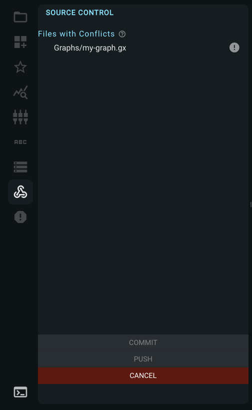
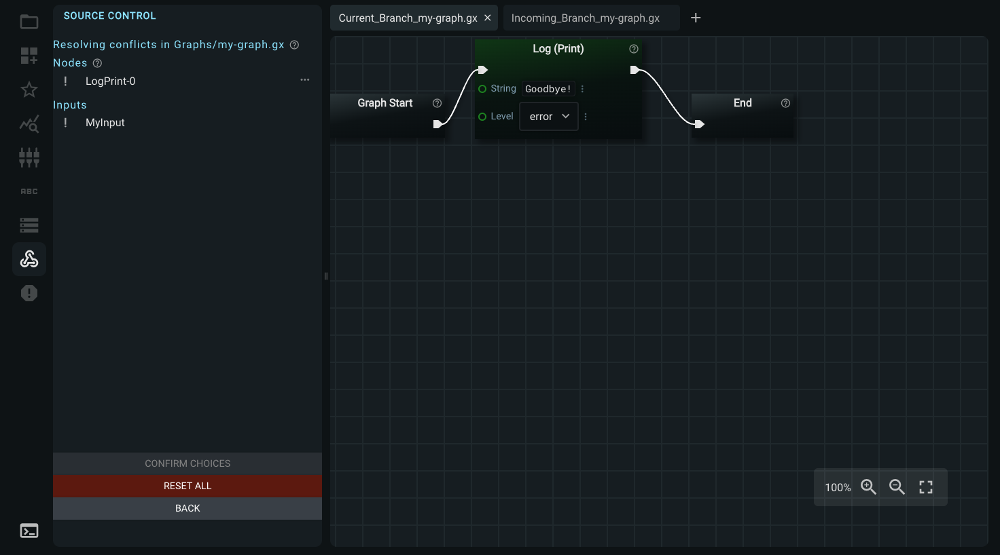
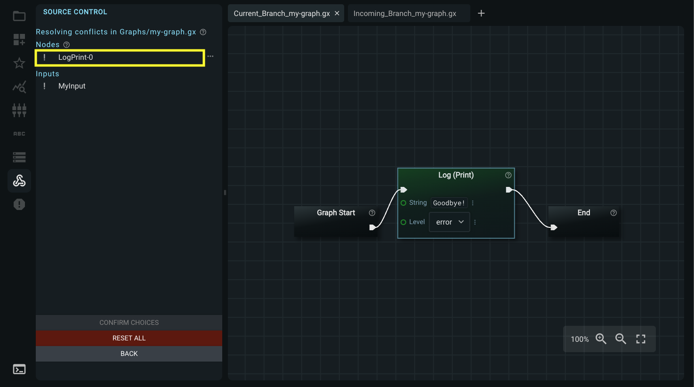
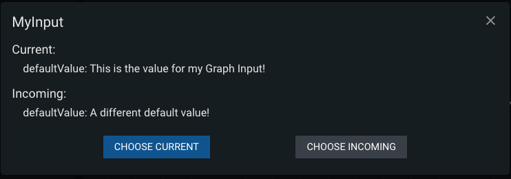
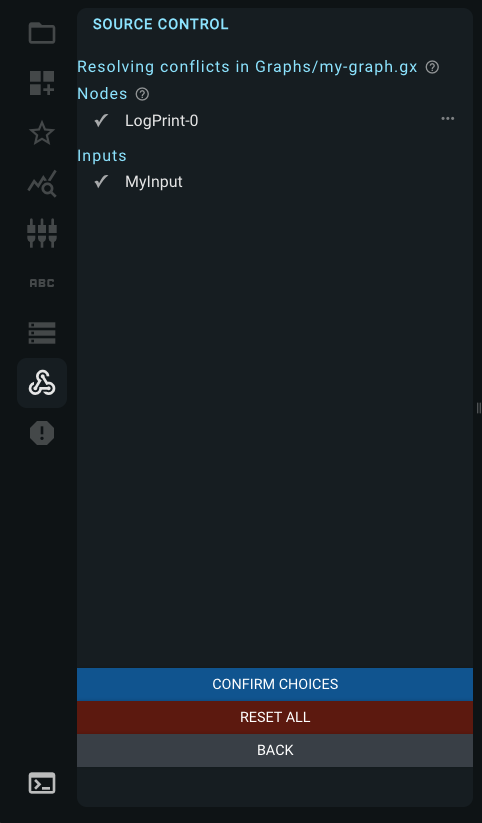
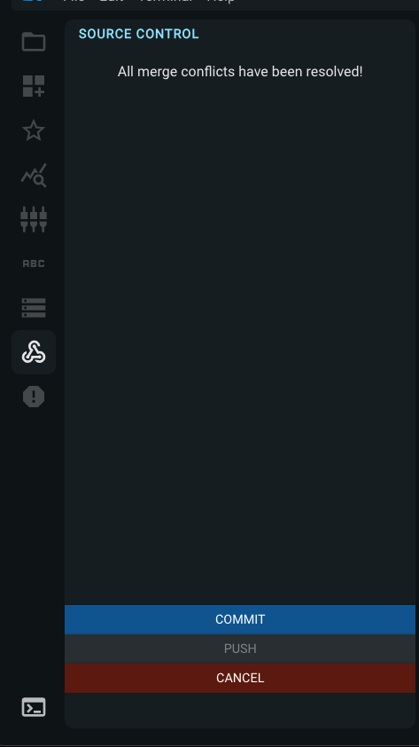

### Merge Conflict Resolution

Once you click View Conflicts, you must either resolve all merge conflicts or cancel the merge before you can perform any other actions in GraphEX.
All Sidebar panel icons and graph functions will be disabled.

The files with conflicts will be listed. Click on the ! icon to the right of each file to view the conflicts and choose which changes will be preserved.

#### View Conflicts

After clicking on a graph to view its conflicts, two graph tabs will open. The first displays the current branch's graph, and the second tab displays the incoming branch's graph. You can click between the two tabs to view the differences of the graph between the branches.

The specific nodes and graph inputs that created the merge conflict will be listed in the left panel.

##### Resolving Nodes

Click on each node in the list to highlight and center the node in both graphs. Click between the two tabs to view the difference.

Click on the three dots next to the node to choose the current or incoming changes. A checkmark will appear next to the resolved node.

##### Resolving Graph Inputs

Click on each input in the list to show the differences between the branches. Choose to keep the current or incoming changes.

#### Resolving File

Once all nodes and graph inputs have been resolved, click Confirm Choices to stage the changes. 

Clicking Reset All will reset your choices and allow you to re-make the choices.

Clicking Back will reset your choices and navigate back to the list of files containing merge conflicts.

#### Conclude Merge Resolution

Once the conflicts in all files have been resolved, you can commit and push the changes. 

