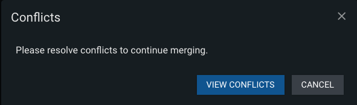

### Remote Branches Tab
The Remote Branches tab gives you the ability to checkout remote branches.

Click on the Home icon in the top left of the pane to return to the tab options.

An asterisk next to the branch name indicates the current branch.

#### Fetch, Pull, or Merge

Click on the three dots next to the current branch to fetch, pull, or merge changes into the branch.

The following modal will appear if a merge conflict occurs when attempting to merge a remote branch into the current branch. Click View Conflicts to begin resolving the merge conflicts, or click Cancel to abort the merge. [Click here](mergeConflictResolutionTab.md) for more information about merge conflict resolution.

#### Switch Branches

Click on the three dots next to a remote branch to checkout the branch

