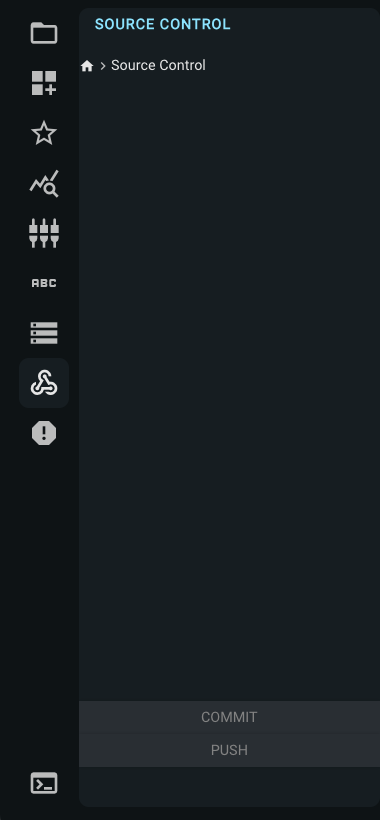
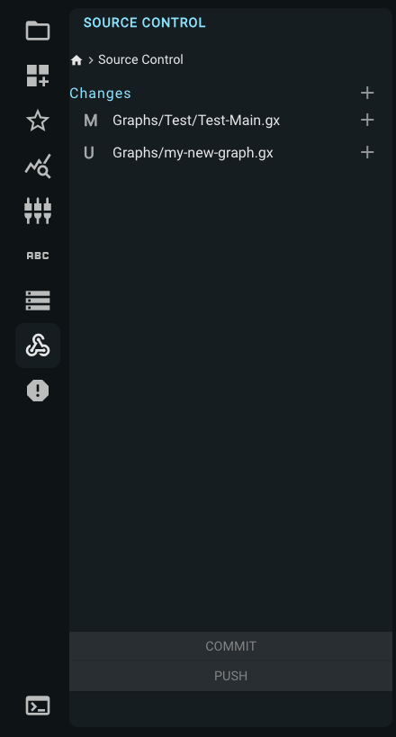
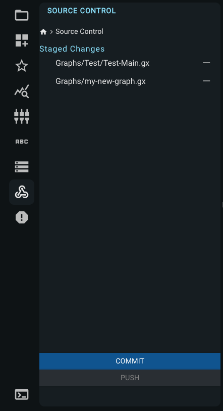
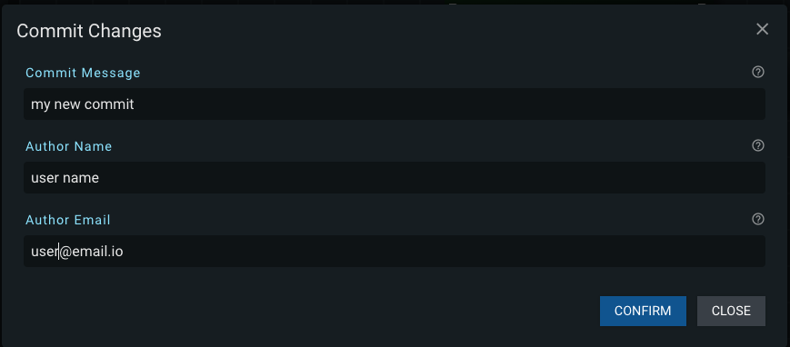
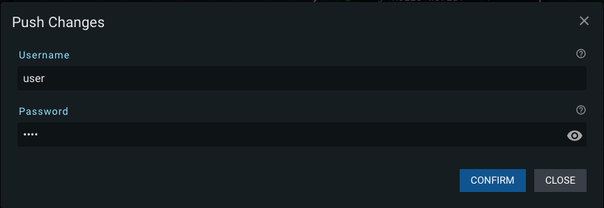

### Source Control Tab

The Source Control tab gives you the ability to stage, commit, and push changes to files on your current branch.

Click on the Home icon in the top left of the pane to return to the tab options.

The tab will be empty if the current branch has no changes.

When a file is changed, it will be listed under Changes. The M icon indicates the file is an existing file that has been modified, and the U icon indicates the file is new.

#### Stage Changes

Click on the + icon next to the files to stage the change, or click on the + icon next to the Changes heading to stage all files in the list.

Once the files have been staged, you can click on the - icon to unstage them, or the Commit button at the bottom of the pane to commit the staged changes to your current branch.

#### Commit Changes

Click the Commit button at the bottom of the pane, then enter the commit message, your username, and email in the modal, then click confirm.

#### Push Committed Changes

Click on the Push button at the bottom of the pane. Enter your git username and password in the modal, then click confirm.

