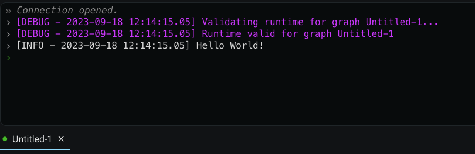
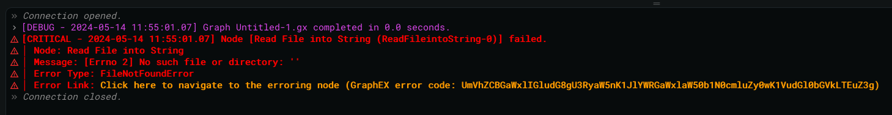

# Terminal Panel

The Terminal Panel is used for viewing the output of graphs that are running. It can also be used to view log files left behind by previous runs.

The Terminal Panel is located at the bottom of the UI and is only visible when: toggled manually via left-clicking the terminal icon (bottom of the Sidebar Panel), a graph starts running/executing, or a log file is opened.

## Terminal Icon

When the Terminal Panel is closed, the icon on the Sidebar Panel will appear white:

When opened, the icon will appear blue.

Left-clicking the icon while the Terminal Panel is closed will open the panel:

The Terminal Panel can be resized by dragging the 'handle' as shown in the above image. The dragged size will be retained when the terminal opens and closes again.

If there are no errors in graph, you will get a blue, clickable 'hyperlink' that opens the 'Run Graph' modal (identical to Run -> Run Graph... in the Menu Bar) when left-clicked.

Any errors detected in the graph will block you from executing the graph in any way. An error message will also appear in the terminal to notify you:

This hyperlink or error message will only appear if the Terminal Panel is opened from a state where no graphs have been executed yet (for informational purposes).

A 'waving' dot animation is displayed underneath the terminal icon if any graphs are currently running/executing:

This animation will continue to play until there are no more graphs executing (regardless if the Terminal Panel is open or not).

Should your graph encounter a 'runtime' error while executing your graph, a red explanation point will appear above the terminal icon to notify you:

Just like the 'running' animation below the terminal icon, the 'error' explanation point will appear and persist even if the Terminal Panel is currently closed. The error icon is automatically dismissed when all erroring graph terminals are either closed or run again.

Warning indicators will also appear if warnings exist for one or more graphs:

A right-click context menu is also available to the terminal icon itself:
- Toggle the Terminal Panel open or closed
- Open a log file (same as 'File' -> 'Open Log File...' from the Menu Bar)
- Close all terminal tabs for the graphs that have finished execution (see [terminal tabs](#terminal-tabs) below for more information on them)

$note$ The error icon takes precedence over the warning icon when graphes with both exist in the currently completed graph output tabs.

## Executing a Graph

There are a number of different ways you can run/execute the current graph in the Editor Panel:
- Clicking on the hyperlink in a 'fresh' Terminal Panel
- From the Menu Bar via 'Run' -> 'Run Graph...'
- Using the hotkey combination 'Alt+R' ('option+R' on Mac)
- From the right-click context menu of graph files in the Files Sidebar Panel

All possible combinations will open the 'Run Modal' as described in [the document on the Menu Bar](menubar.md).

After clicking the blue 'RUN' button in the 'Run Modal': the Terminal Panel will open if currently closed. Your client will send your graph to the server for execution and the panel will show a green, blinking caret ('>') to indicate that it is running. Text will start to ouptut to your terminal:

Notice in the above image that the client informs you of a successful connection with '_Connection Opened._'. All connection status messages will appear in this grey, italized text. Likewise, when the server is finished executing your graph: you will see a '_Connection closed._' message. 

The terminal outputs some debugging information (in purple text) informing us the server was unable to find any validation/preliminary errors with the graph we sent it. These messages can be disabled via the 'Run Modal' by leaving the 'Verbose Logs' checkbox empty.

In the above image we can also see the output of the default graph that Graphex provides you: Hello World!

Each message that is 'printed' (output) to the terminal via the logger will have a timestamp with the date and time of the message.

## Terminal Text Colors

Text that appears in the output of the Terminal is color coded to help you quickly identify the status of the information:

- grey (italized) for connection status messages
- white for 'info' level logging
- purple for 'debug' level logging
- light blue for 'notice' level logging
- yellow for warnings
- red for errors

There are two different color links (underlined when hovered) you may encounter in the Terminal:
- darker blue (hyperlink style) for the link to run the current graph
- orange (hyperlink style) for links to erroring nodes

More information on handling errors and links to erroring nodes can be found [farther down this page](#finding-runtime-errors).

## Terminal Context Menu

Once a graph starts executing: a right-click context menu will become available for the terminal window itself:

It is worth noting that 'Download as Text File...' is slightly different than the log file itself. Left-clicking this option will prompt your browser to download the entire output to a _text_ file (on your local machine). In contrast, log files are stored on the server itself and are stored as JSON (JavaScript Object Notation). It is much easier for a human to read the text file than the JSON log file. If you wish to move a log file from one GraphEx instance to another, you can select the 'Export JSON log' option instead. You can then use the 'File' -> 'Open File (Client)...' option (on the Menu Bar at the top of GraphEx) to open the log file exported from another machine.

Some right-click context menu options in GraphEx (in general) only appear when certain conditions are met. In the case of the terminal panel, you can get the options to 'Cancel Execution' and 'Forcefully Stop Execution' only if the terminal is currently running:

The option to 'Cancel Execution' here is the same as the option to cancel the running graph via the Menu Bar: 'Terminal' -> 'Cancel Run'. Notice that the Menu Bar 'Cancel Run' option is selects the graph to cancel based on the one open in the editor panel, whereas the right-click context menu option 'Cancel Execution' selects based on which terminal is right-clicked.

It is recommended to 'Cancel Execution' or 'Cancel Run' (they are the same functionality) when you want to quit an executing graph early. The only time you should be using 'Forcefully Stop Execution' is if the graph refuses to stop when 'Cancel Execution'/'Cancel Run' fails to stop the graph or, more specifically, when the graph you are trying to cancel has threads that are still executing (disregard this statement if you don't know what [threads](../advanced/threading.md) are).  Using 'Forcefully Stop Execution' is intended to be used as a 'last effort' when you need a graph to stop immediately. Choosing to kill threads while they haven't finished their work can result in undesired side effects (e.g. data corruption).

## Following the Output

The terminal has a built-in feature that 'follows' the messages that are logged to it. This feature is normally activated automatically. When the output is longer than the current vertical height of the terminal: you can override this feature by 'scrolling' through the terminal output. This can be done via the middle 'mouse-wheel' button.

A new button will appear at the bottom of the Terminal Panel if the 'following' feature is disabled. You can turn it back on by clicking the button to 'snap to' the bottom of the terminal:

Additionally, there is a right-click context menu option for 'Enable Auto-Scroll' that you can use to force the 'following' behavior.

## Terminal Tabs

Terminal tabs will start to appear at the bottom of the Terminal Panel for each graph that is currently executing or has executed recently:

The current tab being viewed is indicated by blue underline at the bottom of the tab. In the above image: 'Untitled-1' is the name of the graph for which the output is being viewed.

On the left-hand side of each tab, there is a circle indicator showing if that graph is currently executing or not. A green circle represents an executing graph and a grey circle indicates a graph that has finished executing. In the above image: 'Untitled-2' is currently running/executing.

The color of the text on the tab indicates the status or origin of the tab:
- red if the graph encountered an error
- yellow if the graph originated from an external source (more on this in [the next section](#graphs-with-external-sources))
- white otherwise (nothing of particular to note)

Additionally, different icons will appear under special circumstances. A 'log icon' will appear if you are viewing the log of a previous run:

A 'WIFI icon' will appear if another user is running a graph on the same GraphEx server instance as you (or if you ran a graph and reconnected to the server (in any way)):

Terminal tabs can also be hovered to get a description of why the text color or icon appears different than the normal white color.

### Graphs with External Sources

If the origin of the graph being executed can't be determined by either your client or the server: a 'WIFI icon' will appear next to the name of the executing graph (as shown in the previous section).

#### Connection Loss While Executing

Something that you may encounter is a connection loss (or page refresh) between your computer and the server while executing a graph. Should this happen: there is no need to worry. The server itself will continue to run/execute the graph even while you are disconnected from the server.

If a page refresh occurs: the first thing your client will do is query for any running graphs on the server. For each running graph found, your client will create a terminal tab and send you the log history for that execution. You can see the 'Start' and 'End' of the 'Log History' annotated with the same grey, italicized text that you see when the connection to the server is opened and closed:

The 'WIFI icon' will appear next to the name of the tab to indicate that this graph came from an external source. This happens even if you were the original client to run the graph (the refresh cause you to become a new client and the server can't verify who the original requestor was). You will continue to see realtime output for that graph as it runs.

If the graph finished while you were disconnected: you can find the output for that graph by opening the created log file (File -> Open Log File...).

#### Multiple Users on One Server

If multiple clients are connected to the same server you will see the graphs (and their output) that other clients are running. These graphs will appear in their own terminal tab and will have the 'WIFI icon' next to the name of the graph.

## Searching the Output

You can search each terminal tab individually by toggling on the Searchbar to find matching text in your terminal output. To do so, either right-click the terminal and select 'Toggle Searchbar' or use the built-in keybind: Ctrl + Shift + F. When the searchbar is toggled on, it will appear in upper right-hand corner of the terminal:

The searchbar is automatically selected with a cursor when you toggle it open so you can immediately search for the desired text output in your terminal. All output logs in your terminal that match will be highlighted with a dark blue color. They will remain highlighted until you clear the search from the searchbar (e.g. if you toggle the searchbar closed, the matching results will still be highlighted until you open it again and clear out the search query from the searchbar). An orange box will automatically appear around the first found match while searching:

You can press the 'Enter' key on your keyboard to cycle through each highlighted match (as long as your mouse cursor is inside the search box). Alternatively, you can hold down the 'Shift' key and press 'Enter' to cycle backwards. As you cycle through the matches found, the scrollbar will automatically 'snap to' the current match (selected by the orange box). The 'backward' and 'forward' buttons can also be used to move through the matches. The current match you are 'snapped to' and the total number of matches will be displayed at the bottom of the searchbar component/window.

By default, the results matched on will ignore the upper and lower casing. To enforce matching on case, check the 'Case Sensitive?' checkbox.

You can filter on specific 'types' of log messages by left-clicking on the dropdown (says 'No Filter' by default) and selecting the 'type' of message you would like to match on:

You can filter on types with or without a search query. For example, selecting 'WARNING' without a search query will show you all of the 'WARNING' logs in the current terminal window:

When you are satisfied with your search and want to turn off the text highlighting and selector box: You can remove all formatting from the text by clicking the 'X' button on the right-hand end of the bar or by deleting the search query from the searchbar.

## Finding Runtime Errors

As you might remember, Graphex has built-in features to prevent you from running a graph if it detects any errors. The type of static analysis Graphex does before running a graph is unable to detect _runtime_ errors.

A runtime error occurs while the program is running. One such example is trying to open a file that doesn't exist. Below I have tried to use the 'Read File into String' action node, but I never provided any data for the 'File Path' socket (an 'empty string' was provided.)

At the very bottom of the error you will see a line of orange text. This text is a left-clickable link to navigate to (in the Editor Panel) the node that is failing. Alternatively, the error code can be copied+pasted into the menu bar underneath: 'Help' -> 'Find Erroring Node'. This orange line will only appear if Graphex was able to determine the node where the error occured. The file must still exist somewhere in your GraphEx 'root' diretory (or an open tab in the editor) in order for GraphEx to navigate you to the erroring node.

The top line, with log type of **CRITICAL**, tells you the name of the node that failed. In this case, the node's name is: 'Read File into String' (the node ID is also shown as 'ReadFileintoString-0', but this is less important for you as a user).

There is more error information provided in several indented lines following the 'CRITICAL' statement:
- What node caused the error (Node)?: "Read File into String"
- What is the error being reported (Message)?: " [Errno 2] No such file or directory: '' "
- What 'type' of error is this (Error Type, this is also refered to as the 'Name of the Exception')?: "FileNotFoundError"
- The last line is the clickable link to node that is erroring

This information is provided to be useful to you as the user and isn't particularly useful as a python code developer. If you would like more verbose error output, provide the flag: '-e' (or --errors) to either the 'run' or 'serve' options.

Remember that the issue is usually the simpliest thing out of the information provided to you. In our example above, we shouldn't assume (first) that the issue is something wrong with the python 'open file function'. Instead, we can resolve the problem most simply by seeing that we didn't actually provide a file path to that node (function). When we do provide a file that exists, we see that the error no longer occurs.

It is always possible that you could encounter an actual problem with the Graphex application (or a plugin) itself. Providing both the graph and the error output will be manditory to diagnose the issue. Please direct these inquiries to the entity/location in which you received Graphex from (most likely our Github page).

## Moving On

This concludes the basic overview of all the UI 'panels'. It is recommended you next read [the document on advanced/specialized nodes.](../advanced/nodes.md)

[Or, read about the Text Editor UI](textEditor.md)

[Return to the Main Page](../index.md)