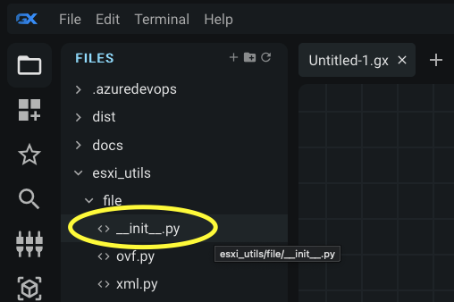
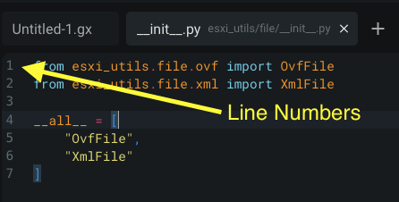
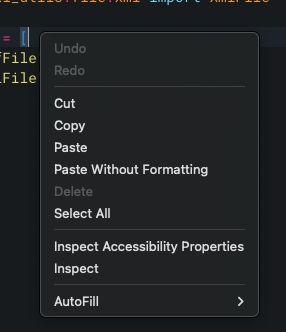
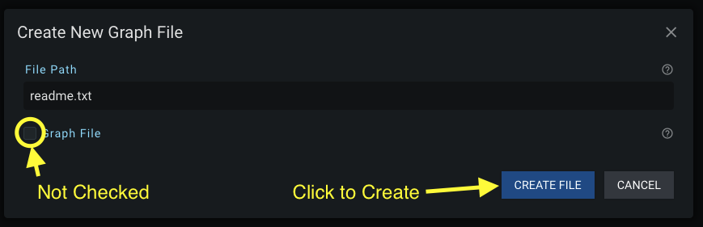
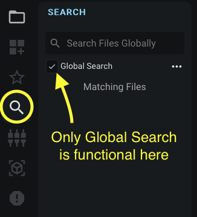
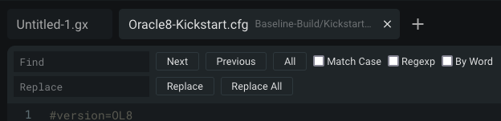
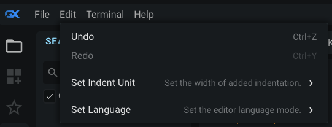
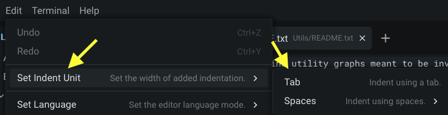
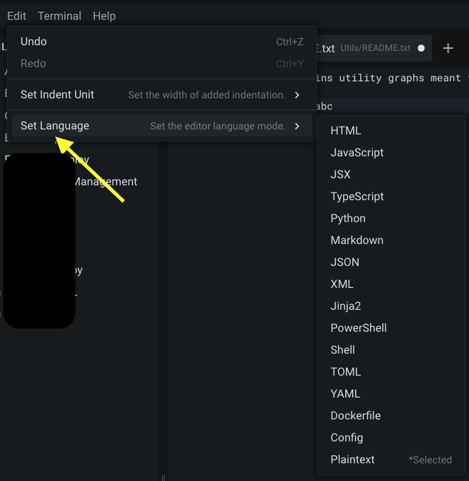

# Text Editor

GraphEx has a built in text editor for quickly creating and modifying files without the '.gx' extension. The Text Editor UI will only appear when a 'non-GX' file is open. The Text Editor UI replaces the Editor Panel when opened. This editor can only be used to edit files from the 'root' directory provided to the GraphEx server.

## Editing a Text File

Left-click any 'non-GX' file in the Files Sidebar to open it in the text editor.

Left click to move your cursor throughout the file. Use your keyboard to type into the file. Text can be highlighted by holding down the left mouse button and dragging the mouse across the text

Line numbers will appear next to the beginning of each line to help you keep track of where you are in the file.

You can right-click anywhere in the text editor to bring up a normal context menu:

When you are done editing the file, select 'File' -> 'Save' from the Menu Bar or use the keybind (Ctrl + S) to save your changes to the file.

## Creating a Text File

You can create 'non-GX' files in GraphEx through the same modal you use to create new GX files in the sidebar. With the 'Files Panel' open in the sidebar on the left-hand side of the screen, you can get to this modal by:
- Clicking the Plus ('+') icon at the top of the sidebar
- Right-Clicking on either a directory or an 'empty space' in the sidebar panel

When the modal opens, type in the name and extension of the file you want to create. Then 'uncheck' (disable) the box that says 'Graph File'. Left-click 'Create File' in order for the text file to be created on the filesystem.

Once the file is created, you can open it by left-clicking it in the Files Sidebar.

## Disabled Sidebar Panels and the Global Search Panel

When using the text editor all of the sidebar panels are disabled except for the Files Panel and the Search Panel. When using the Search Panel only the global search functionality will be available. Read the next section on how to find text in your currently opened text file.

When searching globally the search results will display the line number of the match in the file. Clicking the match in the sidebar will take you to the line in the text editor.

## Searching the Currently Opened File

When the text editor is open, you can use the keybind: 'Ctrl + F' ('Cmd + F' on Mac) in order to open a "find and replace" popup at the top of the text editor:

## New Edit Menu Options

While the text editor is open, the 'Edit' options on the Menu Bar will change:

### Set Indent Unit

You can change the default behavior of the 'tab' key in the text editor by left-clicking on the options in the submenu for 'Set Indent Unit':

The possible options are: tab characters ('\t' character), two space characters or four space characters. The currently selected option will be annotated with the word '(current)' next to the option in the submenu.

### Set Language Color Styling

You can change the color formatting of the text in your currently open file by selecting an option in the 'Set Language' submenu. The editor will attempt to colorize the open file based on the 'language' (e.g. extension) of file that is open in the editor. The editor will automatically attempt to select the correct option for you based on the file extension you open.

If the editor doesn't select the correct style, or if you want to try another one, the available options can be seen by hovering the 'Set Language' option:

[Return to the Main Page](../index.md)